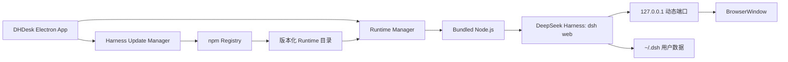
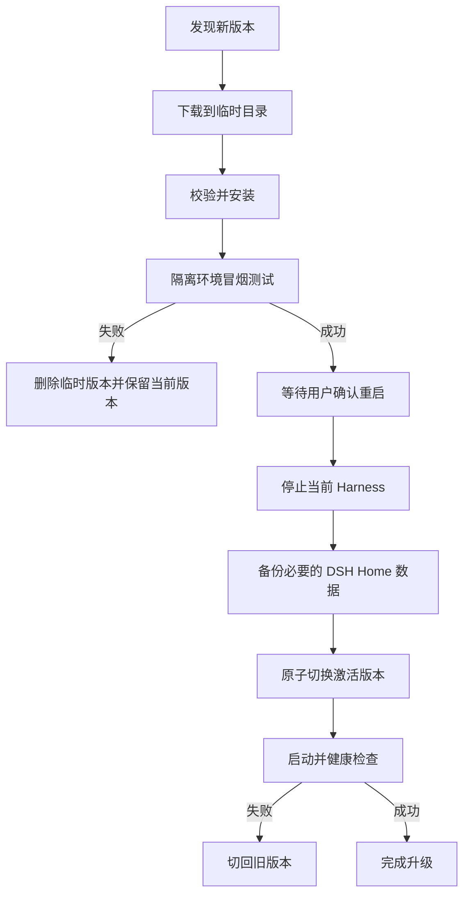

# DHDesk macOS 应用开发计划

## 1. 项目概述

DHDesk 是一个面向 macOS 的 DeepSeek Harness 桌面启动器。应用负责在后台启动并管理 DeepSeek Harness Web 服务，通过桌面窗口展示官方 Web UI，使用户无需手动执行命令或打开浏览器。

应用同时提供独立的 DeepSeek Harness 版本管理能力，包括检查更新、下载安装、重启切换和失败回滚。

### 1.1 核心目标

- 用户双击 `.app` 即可使用 DeepSeek Harness。
- 用户无需单独安装 Node.js、npm、pnpm 或 DeepSeek Harness。
- 尽量不修改 DeepSeek Harness Web UI 和内部实现。
- Harness 作为独立子进程运行，避免影响桌面应用稳定性。
- 支持 Harness 独立升级，并在升级失败时自动回滚。
- 保留现有 `~/.dsh` 配置、凭据、工作区和会话数据。
- 支持 Developer ID 签名、公证和 DMG 分发。

### 1.2 非目标

第一阶段不包含以下内容：

- 不重新开发或 Fork DeepSeek Harness Web UI。
- 不将 Harness 直接集成到 Electron 主进程。
- 不支持 Mac App Store 分发。
- 不支持运行中无感热更新 Harness。
- 不开发独立的模型配置、会话或工作区界面。
- 不在第一版支持 Windows、Linux 和 Intel Mac。
- 不在第一版提供第三方 Harness 插件市场。

## 2. 技术方案

### 2.1 技术选型

| 模块 | 选型 | 说明 |
|---|---|---|
| 桌面框架 | Electron + TypeScript | 与 Web UI 兼容性高，便于管理 Node 子进程和应用升级 |
| Web 容器 | Electron `BrowserWindow` | 加载 Harness 输出的本地 HTTP URL |
| Harness Runtime | 独立 Node.js 进程 | 与 Electron 主进程隔离，便于重启和回滚 |
| Node.js | 应用内置独立 Runtime | 不依赖用户系统环境，版本满足 Harness 要求 |
| Harness 来源 | npm `@deepseek-ai/dsh` | 使用官方发布渠道进行安装和升级 |
| 应用设置 | `electron-store` 或等价本地存储 | 保存激活版本、更新偏好和窗口状态 |
| 应用自动升级 | `electron-updater` | 用于升级 DHDesk 自身，与 Harness 更新分离 |
| 打包 | `electron-builder` | 生成签名、公证后的 DMG |

### 2.2 总体架构



### 2.3 核心设计原则

1. **黑盒托管**：将 Harness 视为独立本地服务，只依赖 CLI 启动方式和服务 URL。
2. **进程隔离**：Harness 崩溃或升级不应导致 Electron 主进程退出。
3. **运行时与数据分离**：Harness 程序安装在 DHDesk 应用数据目录，用户数据继续存放在 `~/.dsh`。
4. **版本化安装**：每个 Harness 版本安装到独立目录，不覆盖正在使用的版本。
5. **原子切换**：只有新版本验证通过后才切换激活版本。
6. **可恢复**：应用包内始终保留一个可用的出厂 Runtime。
7. **最小权限暴露**：Web 服务只监听 `127.0.0.1`，不对局域网开放。

## 3. 目录规划

### 3.1 项目源码目录

```text
DHDesk/
├── docs/
│   └── development-plan.md
├── src/
│   ├── main/
│   │   ├── app.ts
│   │   ├── window-manager.ts
│   │   ├── runtime-manager.ts
│   │   ├── process-supervisor.ts
│   │   ├── update-manager.ts
│   │   ├── settings-store.ts
│   │   ├── logging.ts
│   │   └── security.ts
│   ├── preload/
│   │   └── index.ts
│   ├── renderer/
│   │   ├── startup.html
│   │   ├── startup.ts
│   │   └── startup.css
│   └── shared/
│       ├── contracts.ts
│       └── errors.ts
├── resources/
│   ├── node/
│   ├── bundled-runtime/
│   ├── entitlements.mac.plist
│   └── icons/
├── scripts/
│   ├── prepare-node-runtime.ts
│   ├── prepare-harness-runtime.ts
│   ├── notarize.ts
│   └── verify-package.ts
├── tests/
│   ├── unit/
│   ├── integration/
│   └── e2e/
├── package.json
├── tsconfig.json
└── electron-builder.yml
```

### 3.2 用户机器目录

```text
~/Library/Application Support/DHDesk/
├── runtimes/
│   ├── <version>/
│   │   ├── node_modules/
│   │   ├── package.json
│   │   └── package-lock.json
│   └── ...
├── downloads/
├── backups/
├── logs/
├── active-runtime.json
└── settings.json

~/.dsh/
├── profiles/
├── settings.yaml
├── .credentials.yaml
└── 其他 Harness 用户数据
```

约束：

- 不修改 `.app` 内的 Runtime，避免破坏代码签名。
- 不将 API Key 写入 DHDesk 设置或日志。
- 不删除 `~/.dsh`，卸载 DHDesk 时默认保留用户数据。

## 4. 功能需求

### 4.1 应用启动

- [ ] 应用只允许一个实例运行。
- [ ] 启动时显示本地加载页，而不是空白窗口。
- [ ] 检查当前激活的 Harness Runtime 是否完整。
- [ ] 激活版本不可用时使用应用内置版本。
- [ ] 使用内置 Node.js 启动 Harness 子进程。
- [ ] 通过 `--host 127.0.0.1 --port 0` 使用本机动态端口。
- [ ] 捕获并解析 Harness 输出的服务 URL。
- [ ] 服务准备完成后加载官方 Web UI。
- [ ] 启动超时或失败时展示可读错误及日志入口。

建议启动命令结构：

```text
<bundled-node> <runtime>/node_modules/@deepseek-ai/dsh/lib/bin.js web \
  --host 127.0.0.1 \
  --port 0
```

### 4.2 Harness 进程管理

- [ ] 保存子进程 PID、版本、启动时间和服务 URL。
- [ ] 分别捕获 `stdout` 和 `stderr` 并写入滚动日志。
- [ ] Harness 异常退出时显示错误页面。
- [ ] 提供“重新启动 Harness”操作。
- [ ] 限制连续自动重启次数，防止崩溃循环。
- [ ] 应用退出时向 Harness 发送 `SIGTERM`。
- [ ] 等待最多 5 秒完成优雅退出。
- [ ] 超时后再执行强制终止。
- [ ] 确保应用退出后没有遗留端口和子进程。

### 4.3 Web 窗口

- [ ] 仅允许主窗口加载当前 Harness 的 loopback URL。
- [ ] 外部 HTTP/HTTPS 链接使用系统默认浏览器打开。
- [ ] 阻止新窗口加载不可信本地页面。
- [ ] 禁用 Renderer 的 Node.js 集成。
- [ ] 开启 Context Isolation。
- [ ] 使用最小化 preload API。
- [ ] 支持复制、粘贴、下载和常用快捷键。
- [ ] 保存和恢复窗口尺寸及位置。
- [ ] 支持 Harness 页面刷新，但不重复启动服务。

### 4.4 工作区与数据

- [ ] 复用 Harness 自带的 macOS 原生目录选择器。
- [ ] 默认复用官方 `~/.dsh` 数据目录。
- [ ] 重启应用后保留模型配置、工作区和会话。
- [ ] 更新 Runtime 不覆盖 `~/.dsh`。
- [ ] 日志中脱敏用户目录、API Key 和环境变量。

### 4.5 状态和诊断界面

- [ ] 显示 DHDesk 版本。
- [ ] 显示当前 Harness 版本。
- [ ] 显示 Node.js Runtime 版本。
- [ ] 显示 Harness 运行状态和本地 URL。
- [ ] 提供打开日志目录操作。
- [ ] 提供复制诊断信息操作，默认排除敏感信息。
- [ ] 提供重启 Harness 操作。

## 5. Harness 更新系统

### 5.1 更新策略

Harness 更新与 DHDesk 应用更新完全分离。Harness 更新来源为官方 npm Registry 包 `@deepseek-ai/dsh`。

支持两种更新通道：

- **稳定通道**：只接收 npm `latest` 中的稳定版本。
- **预览通道**：允许安装 `rc`、`beta` 等预发布版本。

在 Harness 尚未发布稳定版本时，默认使用预览通道，但不得静默自动安装。

### 5.2 检查更新

- [ ] 启动后异步检查更新，不阻塞 Harness 启动。
- [ ] 提供手动“检查更新”操作。
- [ ] 设置检查频率，避免每次窗口激活都请求 Registry。
- [ ] 展示当前版本、目标版本和是否为预发布版本。
- [ ] 网络不可用时继续使用当前 Runtime。
- [ ] 不将本地配置、凭据或设备路径发送到更新服务。

### 5.3 下载与安装

- [ ] 下载到独立临时目录。
- [ ] 校验 npm 元数据中的 SHA-512 integrity。
- [ ] 使用应用内置 Node.js/npm 安装完整生产依赖。
- [ ] 生成并保留 `package-lock.json`。
- [ ] 禁止覆盖现有版本目录。
- [ ] 对解压路径进行校验，防止目录穿越。
- [ ] 限制下载大小和安装超时时间。
- [ ] 安装失败时清理临时目录，不影响当前版本。

### 5.4 安装后验证

切换版本前必须完成以下检查：

- [ ] Runtime 目录结构完整。
- [ ] `dsh --version` 返回目标版本。
- [ ] 使用临时 `DSH_HOME` 启动 `dsh web`。
- [ ] 服务能在规定时间内输出 URL。
- [ ] 对首页执行 HTTP 健康检查并获得成功响应。
- [ ] 正常发送 `SIGTERM` 并确认进程退出。
- [ ] 验证完成后删除临时测试数据。

### 5.5 切换和回滚



- [ ] Agent 正在执行任务时不强制重启。
- [ ] 更新完成后提示“退出并升级”或“稍后”。
- [ ] 切换前记录上一个可用版本。
- [ ] 新版本首次启动前备份 `~/.dsh` 关键数据。
- [ ] 新版本启动失败时自动切回上一个版本。
- [ ] 至少保留一个旧版本和应用内置版本。
- [ ] 提供手动选择已安装版本的高级功能。

注意：如果新版本迁移了 `~/.dsh` 数据格式，只回滚 Runtime 可能不足。数据恢复必须由用户确认，避免覆盖升级后创建的新会话。

## 6. 安全要求

### 6.1 本地服务安全

- [ ] Harness 只监听 `127.0.0.1`。
- [ ] 不允许通过设置切换为 `0.0.0.0`。
- [ ] 不在 UI 中暴露可复制给远程设备的服务地址。
- [ ] 主窗口导航采用 URL 白名单。
- [ ] 拦截未知协议和非预期重定向。

### 6.2 Electron 安全

- [ ] `nodeIntegration: false`。
- [ ] `contextIsolation: true`。
- [ ] `sandbox: true`，仅针对 Renderer；不启用 macOS App Sandbox。
- [ ] preload 不提供任意命令执行能力。
- [ ] IPC 接口使用固定 schema 校验参数。
- [ ] 禁止 Renderer 直接控制 Harness 子进程。
- [ ] 禁止 Renderer 任意读写本地文件。

### 6.3 凭据和日志

- [ ] DHDesk 不读取或缓存 `~/.dsh/.credentials.yaml` 内容。
- [ ] 日志过滤常见 Token、Authorization Header 和环境变量值。
- [ ] 崩溃报告默认不包含 Harness 完整输出。
- [ ] 更新备份包含凭据时使用仅当前用户可读权限。
- [ ] “复制诊断信息”明确列出将复制的字段。

### 6.4 发布安全

- [ ] 对 Electron App、Node sidecar 和嵌套原生二进制完成签名。
- [ ] 启用 Hardened Runtime。
- [ ] 配置 Node/V8 所需的 JIT entitlement。
- [ ] 完成 Apple Notarization 和 Stapling。
- [ ] 发布包中包含 DeepSeek Harness、Electron、Node.js 及第三方许可证。
- [ ] 产品命名和图标避免暗示为 DeepSeek 官方应用。

## 7. 开发阶段

### 阶段 0：技术验证

目标：验证最关键的打包和运行链路。

- [x] 初始化 Electron + TypeScript 工程。
- [x] 下载并内置兼容版本的 Node.js。
- [x] 构建一个固定版本的 Harness Runtime。
- [x] 从 Electron 主进程启动 `dsh web`。
- [x] 解析动态端口并在 BrowserWindow 中加载 Web UI。
- [x] 验证模型设置页面可用。
- [ ] 验证 macOS 原生工作区选择器可打开（控件已确认，原生对话框仍需人工验收）。
- [ ] 验证 Agent 可以读取文件、修改文件和运行 Shell（需要用户配置有效模型凭据）。
- [x] 验证退出应用后 Harness 进程正常结束。
- [x] 对未公证包进行本机打包测试。

交付物：可双击运行的内部测试 `.app`。

验收标准：不安装系统 Node.js，也能完整启动并使用 Harness Web UI。

### 阶段 1：桌面应用 MVP

目标：完成可靠的日常启动和进程管理。

- [ ] 实现单实例控制。
- [ ] 实现启动页、错误页和重试操作。
- [ ] 实现 Runtime 解析和出厂版本回退。
- [ ] 实现 Harness 进程状态机。
- [ ] 实现日志轮转和日志目录入口。
- [ ] 实现窗口状态恢复。
- [ ] 实现外部链接和下载处理。
- [ ] 实现安全导航和 preload 边界。
- [ ] 验证 `~/.dsh` 数据跨重启保持。
- [ ] 添加单元测试和基础集成测试。

交付物：具备稳定启动、运行、重启和关闭能力的 MVP。

### 阶段 2：Harness 更新与回滚

目标：让用户不通过命令行升级 Harness。

- [ ] 实现 npm 版本查询和更新通道。
- [ ] 实现下载、integrity 校验和安装进度。
- [ ] 实现版本化 Runtime 目录。
- [ ] 实现安装后隔离冒烟测试。
- [ ] 实现原子激活版本切换。
- [ ] 实现更新等待和重启确认。
- [ ] 实现启动失败自动回滚。
- [ ] 实现旧版本清理策略。
- [ ] 实现数据备份和恢复提示。
- [ ] 添加断网、损坏包、安装失败和回滚测试。

交付物：支持检查、安装、切换和回滚 Harness 的版本管理功能。

### 阶段 3：签名、公证和发布

目标：生成可在其他 Mac 安全安装的正式版本。

- [ ] 配置 Electron Builder。
- [ ] 配置 Apple Developer ID 证书。
- [ ] 签名所有嵌套二进制。
- [ ] 完成 Hardened Runtime entitlement。
- [ ] 自动执行 Notarization 和 Stapling。
- [ ] 生成 DMG 和校验文件。
- [ ] 在一台干净 Mac 上进行安装测试。
- [ ] 验证 Gatekeeper 无警告启动。
- [ ] 验证无开发环境时 Harness 更新可用。
- [ ] 整理开源许可证和隐私说明。

交付物：签名、公证并可分发的 DMG。

### 阶段 4：DHDesk 自更新和增强

该阶段不阻塞 Harness 升级功能。

- [ ] 接入 DHDesk 自身自动更新。
- [ ] 增加菜单栏运行模式。
- [ ] 增加 Harness 已安装版本管理页。
- [ ] 增加更新历史和失败原因展示。
- [ ] 评估 Intel Mac 支持。
- [ ] 评估稳定版 Harness 发布后的通道迁移。

## 8. 测试计划

### 8.1 单元测试

- Runtime 路径解析和版本比较。
- Harness stdout URL 解析。
- 进程状态机和重启限制。
- npm integrity 校验。
- 激活版本原子切换。
- 日志和诊断信息脱敏。
- 导航白名单和外部链接判断。

### 8.2 集成测试

- 使用内置 Node 启动 Harness。
- 动态端口分配和首页健康检查。
- `SIGTERM` 优雅退出。
- Harness 崩溃后的 UI 状态和重启。
- 当前 Runtime 损坏时回退到内置版本。
- 更新安装失败时保持当前版本。
- 新版本启动失败时自动回滚。
- `~/.dsh` 在不同 Runtime 版本之间保持可见。

### 8.3 端到端测试

- 首次安装并启动应用。
- 添加工作区并创建会话。
- 配置模型并发送消息。
- 执行文件读取、修改和 Shell 命令。
- 关闭并重新打开应用后继续会话。
- 检查并安装 Harness 更新。
- 重启后确认目标版本运行。
- 模拟升级失败并确认旧版本恢复。
- 断网状态下正常使用已安装版本。
- 卸载 DHDesk 后确认用户数据仍被保留。

### 8.4 发布验证环境

- macOS 14 Apple Silicon。
- macOS 15 Apple Silicon。
- macOS 当前最新稳定版 Apple Silicon。
- 无系统 Node.js、npm 和 pnpm 的干净用户环境。
- 有既存 `~/.dsh` 的升级环境。
- 网络受限和完全离线环境。

## 9. 验收标准

正式版必须满足：

- [ ] 双击 App 后无需终端操作即可进入 Harness Web UI。
- [ ] 用户机器不需要预装 Node.js。
- [ ] 首次启动、普通重启和系统重启后的启动均可靠。
- [ ] 工作区选择、文件编辑和 Shell 工具正常工作。
- [ ] 关闭 App 后不存在遗留 Harness 进程。
- [ ] 更新失败不会破坏当前可用版本。
- [ ] 新版本无法启动时能自动回滚。
- [ ] 离线状态仍能启动已安装 Runtime。
- [ ] 现有 `~/.dsh` 数据不会被安装或更新流程覆盖。
- [ ] App 通过 Apple 签名、公证和 Gatekeeper 验证。
- [ ] 主窗口无法导航到未授权本地服务或任意外部页面。
- [ ] 日志和诊断数据不包含明文 API Key。

## 10. 风险与应对

| 风险 | 影响 | 应对措施 |
|---|---|---|
| Harness 仍处于开发者预览 | CLI、配置或数据格式可能破坏兼容 | 锁定版本、隔离安装、冒烟测试、保留旧版本和数据备份 |
| npm 包依赖版本漂移 | 同一顶层版本可能解析出不同依赖集合 | 保存 lockfile、校验 integrity、安装后完整冒烟测试 |
| App 退出时 Agent 正在工作 | 文件操作或会话写入可能中断 | 退出确认、SIGTERM 优雅停止、等待超时后才强制终止 |
| 新版本迁移 `~/.dsh` | 单纯回滚程序可能无法恢复 | 更新前快照、数据恢复需用户确认 |
| Node 或原生依赖签名不完整 | Gatekeeper 拒绝运行 | 构建阶段递归签名，并在干净 Mac 验证 |
| Electron 页面被导航到恶意地址 | 本地能力可能受到攻击 | 导航白名单、禁用 Node Integration、最小 IPC |
| Mac App Store 沙箱限制 | 无法自由操作工程和执行 Shell | 使用 Developer ID + Notarized DMG 分发 |
| OAuth 登录在 WebView 中行为异常 | 部分模型 Provider 无法登录 | 拦截外部登录并用系统浏览器处理，单独测试回调流程 |

## 11. 待确认决策

开始正式开发前需要确认：

- [ ] 产品名称是否最终使用 `DHDesk`。
- [ ] 第一版是否只支持 Apple Silicon。
- [ ] 最低系统版本是否确定为 macOS 14。
- [ ] Harness 更新是仅手动检查，还是允许自动下载后提示重启。
- [ ] 是否默认复用 `~/.dsh`，还是提供独立的 DHDesk Harness Home。
- [ ] 是否需要 DHDesk 自身的自动更新服务。
- [ ] 发布渠道使用 GitHub Releases、自有服务器还是对象存储。
- [ ] 是否需要匿名崩溃报告；如需要，必须先定义脱敏策略。

## 12. 参考资料

- [DeepSeek Harness 项目](https://github.com/deepseek-ai/deepseek-harness)
- [DeepSeek Harness 中文 README](https://github.com/deepseek-ai/deepseek-harness/blob/master/README.zh.md)
- [CLI 行为说明](https://github.com/deepseek-ai/deepseek-harness/blob/master/apps/cli/reference/README.md)
- [Web UI 使用指南](https://github.com/deepseek-ai/deepseek-harness/blob/master/docs/user/guide/index.md)
- [Harness 架构说明](https://github.com/deepseek-ai/deepseek-harness/blob/master/docs/architecture.md)
- [DSH Home 路径说明](https://github.com/deepseek-ai/deepseek-harness/blob/master/packages/util/home-paths/README.md)
- [目录选择器说明](https://github.com/deepseek-ai/deepseek-harness/blob/master/packages/host/directory-picker-auto/README.md)
- [npm: `@deepseek-ai/dsh`](https://www.npmjs.com/package/@deepseek-ai/dsh)
