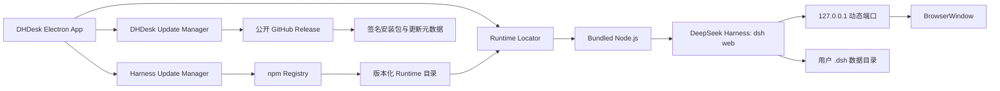

# DHDesk macOS / Windows 双平台开发计划

> 目标平台：macOS 14+ arm64、Windows 10 22H2 / Windows 11 x64
>
> 当前版本：`0.1.3`
>
> 当前分支：`main`
>
> 最后同步：2026-08-15
>
> 状态依据：当前仓库源码、36 项自动化测试、GitHub Actions 双平台成功构建及 macOS/Windows 0.1.1 → 0.1.2 真机更新验收

## 1. 项目概述

DHDesk 是 DeepSeek Harness 的非官方桌面启动器和 Runtime 管理器。应用在后台启动并管理 DeepSeek Harness Web 服务，通过 Electron 窗口展示官方 Web UI，使用户无需手动执行命令或打开浏览器。

DHDesk 同时提供独立的 Harness 版本管理能力，包括检查、下载、完整性校验、隔离验证、切换和失败回滚。Harness 更新与 DHDesk 自身更新相互独立。

### 1.1 核心目标

- [x] 同一套 Electron + TypeScript 代码支持 macOS arm64 和 Windows x64。
- [x] 用户无需预装 Node.js、npm、pnpm 或 DeepSeek Harness。
- [x] 双击应用即可启动 Harness Web UI，无需终端操作。
- [x] Harness 作为独立子进程运行，避免影响 Electron 主进程稳定性。
- [x] 应用内置目标平台原生 Node.js 和出厂 Harness Runtime。
- [x] 支持 Harness 独立升级，并在新版本启动失败时自动回滚。
- [x] 保留官方 `.dsh` 配置、凭据、工作区和会话数据。
- [x] GitHub Actions 可分别生成 macOS DMG 和 Windows NSIS Setup EXE。
- [ ] 生成完成正式签名、公证和安装验证的双平台发布包。

### 1.2 当前支持矩阵

| 平台 | 最低目标版本 | 架构 | 安装产物 | CI 构建 | 正式签名 |
|---|---|---|---|---|---|
| macOS | macOS 14 | arm64 | DMG + 更新 ZIP | 已完成 | Developer ID 签名、公证、Stapling 和 Gatekeeper 验证已完成 |
| Windows | Windows 10 22H2 / Windows 11 | x64 | NSIS Setup EXE | 已完成 | 未完成 Authenticode 签名 |

### 1.3 非目标

当前版本不包含：

- Intel Mac、Windows arm64 和 Linux。
- Mac App Store、Microsoft Store 和 Windows portable 分发。
- Fork 或重新开发 DeepSeek Harness Web UI。
- 将 Harness 直接集成到 Electron 主进程。
- 运行中无感热更新 Harness。
- 独立的模型配置、会话或工作区界面。
- Harness 插件市场。
- 自动迁移或静默恢复 `.dsh` 用户数据。

## 2. 技术方案

### 2.1 技术选型

| 模块 | 当前选型 | 状态 |
|---|---|---|
| 桌面框架 | Electron 43 + TypeScript | 已实现 |
| Web 容器 | Electron `BrowserWindow` | 已实现 |
| Harness Runtime | 应用内置 Node.js 启动独立子进程 | 已实现 |
| 出厂 Runtime | `@deepseek-ai/dsh@0.1.0-rc.6` | 已实现 |
| Harness 更新 | npm Registry + 版本化 Runtime 目录 | 核心链路已实现 |
| DHDesk 自更新 | `electron-updater` + 公开 GitHub Release | 已实现手动检查、下载和重启安装 |
| macOS 打包 | electron-builder DMG + ZIP arm64 | Developer ID 签名、公证、Stapling 和 Gatekeeper 验证已完成 |
| Windows 打包 | electron-builder NSIS x64 | 已实现未签名 CI 包 |
| CI | GitHub Actions 原生双平台矩阵 | 已实现 |

当前 Runtime 版本读取自 `resources/runtime-manifest.json`：

| 组件 | 版本 |
|---|---|
| Node.js | `v24.19.0` |
| DeepSeek Harness | `0.1.0-rc.6` |

### 2.2 总体架构



### 2.3 核心设计原则

1. **黑盒托管**：只依赖 Harness CLI 启动方式和本地服务 URL。
2. **进程隔离**：Harness 崩溃或升级不直接导致 Electron 主进程退出。
3. **运行时与数据分离**：DHDesk 管理程序 Runtime，Harness 用户数据继续使用官方 `.dsh`。
4. **目标平台原生构建**：macOS 和 Windows 分别在对应原生 Runner 准备 Runtime 和打包。
5. **版本化安装**：每个 Harness 版本安装到独立目录，不覆盖正在使用的版本。
6. **原子切换与回滚**：新版本验证通过后才激活，启动失败时切回上一版本。
7. **出厂兜底**：应用包始终内置一个与平台和架构匹配的可用 Runtime。
8. **最小权限暴露**：Harness 仅监听 `127.0.0.1`，Renderer 不获得 Node.js 或命令执行权限。

## 3. 目录与 Runtime 约定

### 3.1 当前源码目录

```text
DHDesk/
├── .github/workflows/build.yml
├── docs/
│   ├── development-plan.md
│   ├── windows-support-plan.md
│   └── windows-support-requirements.md
├── src/
│   ├── main/
│   │   ├── app.ts
│   │   ├── active-runtime.ts
│   │   ├── harness-updater.ts
│   │   ├── logging.ts
│   │   ├── process-supervisor.ts
│   │   ├── process-tree.ts
│   │   ├── runtime-locator.ts
│   │   ├── runtime-metadata.ts
│   │   ├── runtime-platform.ts
│   │   └── window-manager.ts
│   ├── preload/index.ts
│   ├── renderer/
│   └── shared/contracts.ts
├── resources/
│   ├── node/
│   ├── bundled-runtime/
│   ├── runtime-manifest.json
│   ├── entitlements.mac.plist
│   └── icons/
├── scripts/
├── tests/
├── electron-builder.base.yml
├── electron-builder.mac.yml
├── electron-builder.win.yml
└── package.json
```

### 3.2 构建期 Runtime 布局

macOS：

```text
resources/node/
├── bin/node
├── bin/npm
├── bin/npx
└── lib/node_modules/npm/
```

Windows：

```text
resources/node/
├── node.exe
├── npm.cmd
├── npx.cmd
└── node_modules/npm/
```

业务运行时使用 `node[.exe] <npm-cli.js>` 调用 npm，不依赖 Windows shell 执行 `npm.cmd` 或 `npx.cmd`。

两个平台的出厂 Harness 目录保持一致：

```text
resources/bundled-runtime/
├── package.json
├── package-lock.json
├── runtime-platform.json
└── node_modules/@deepseek-ai/dsh/
```

`runtime-platform.json` 用于记录并校验平台、架构、Node.js 版本和 Harness 版本，避免跨平台 Runtime 混用。

### 3.3 用户机器目录

| 用途 | macOS | Windows |
|---|---|---|
| DHDesk 应用数据 | `~/Library/Application Support/DHDesk/` | `%APPDATA%\DHDesk\` |
| Harness 用户数据 | `~/.dsh/` | `%USERPROFILE%\.dsh\` |

应用数据目录包含版本化 Runtime、下载临时目录、激活版本记录和更新状态。安装、升级和默认卸载均不得删除 `.dsh`。

## 4. 桌面应用功能状态

### 4.1 启动与 Runtime 定位

- [x] 应用只允许一个实例运行，第二次启动聚焦现有窗口。
- [x] 启动时显示本地加载页，失败时显示错误详情和重试入口。
- [x] 检查当前激活 Runtime 的完整性、平台、架构和版本元数据。
- [x] 管理 Runtime 不可用时回退到应用内置版本。
- [x] 使用应用内置 Node.js 启动 Harness。
- [x] 使用 `--host 127.0.0.1 --port 0` 分配 loopback 动态端口。
- [x] 解析 Harness 输出 URL，并执行 HTTP 健康检查。
- [x] 服务就绪后加载官方 Web UI。
- [x] macOS 和 Windows 使用各自原生 Node/npm 路径布局。
- [x] 旧版无平台标记的可用 Runtime 经过校验后自动补写标记。

### 4.2 Harness 进程管理

- [x] 跟踪子进程生命周期、Harness 版本和服务 URL。
- [x] 分别捕获 `stdout`、`stderr` 并写入限制大小的日志文件。
- [x] Harness 启动失败或异常退出时更新错误状态。
- [x] 提供“重新启动 Harness”菜单操作。
- [x] macOS 使用独立进程组，先发送 `SIGTERM`，超时后发送 `SIGKILL`。
- [x] Windows 隐藏 Node/npm 控制台窗口，并使用 `taskkill /T` 结束完整进程树。
- [x] 正常停止最多等待 5 秒，超时后执行强制终止。
- [x] 更新安装和冒烟测试进程复用统一进程树清理逻辑。
- [ ] 增加有限次数的 Harness 自动重启策略，防止崩溃循环。
- [ ] 在真实 Windows 环境验证退出后没有遗留 `node.exe`、`conhost.exe` 或 Harness 子进程。

Windows 上 `child.kill("SIGTERM")` 不等同于 Unix 优雅退出；当前实现以终止完整进程树和避免残留为目标，不承诺 Harness 一定执行信号清理逻辑。

### 4.3 Web 窗口与平台界面

- [x] 主窗口只允许加载当前 Harness loopback Origin。
- [x] 外部 HTTP/HTTPS 链接交给系统默认浏览器。
- [x] 阻止新窗口、WebView 和未授权导航。
- [x] `nodeIntegration: false`、`contextIsolation: true`、`sandbox: true`。
- [x] preload 仅暴露固定 IPC 操作。
- [x] 刷新 Harness 页面不会重复启动服务。
- [x] macOS 和 Windows 使用各自有效的应用菜单。
- [x] 更新窗口的 macOS 标题栏按钮逻辑具有平台保护。
- [x] 主窗口关闭按钮在 macOS 隐藏窗口、在 Windows 最小化到任务栏；点击 Dock 图标可恢复 macOS 窗口，菜单“退出”或 `Command+Q` 仍执行完整退出流程。
- [ ] 保存并恢复主窗口尺寸和位置。
- [ ] 明确处理 Web UI 下载行为和下载完成提示。
- [ ] 在 Windows 100%、125%、150%、200% 显示缩放下验收布局和点击位置。

### 4.4 工作区、数据和诊断

- [x] 默认复用 Harness 官方 `.dsh` 数据目录。
- [x] 更新 Runtime 不覆盖 `.dsh`。
- [x] 日志文件使用仅当前用户可读权限。
- [x] 日志脱敏常见 API Key、Bearer Token、token 和 secret 字段。
- [x] 提供打开日志目录操作。
- [x] 提供重启 Harness 操作。
- [ ] 在双平台人工验证工作区选择、文件读写和 Shell 工具。
- [ ] 日志进一步脱敏用户目录和敏感环境变量值。
- [ ] 提供复制诊断信息操作，并明确列出和脱敏复制字段。
- [ ] 增加独立状态页，统一显示 DHDesk、Harness、Node.js 版本和运行状态。
- [ ] 保存和恢复窗口状态及其他用户偏好。

## 5. Harness 更新系统

Harness 更新与 DHDesk 自身更新完全分离。当前实现只在用户打开更新窗口并确认后执行检查、安装或重启，不静默下载和切换 Runtime。

### 5.1 检查更新

- [x] 从 npm Registry 查询 `@deepseek-ai/dsh` 的 `latest` 版本。
- [x] 提供手动“检查 Harness 更新”操作和跨平台快捷键。
- [x] 展示当前版本、目标版本和预发布版本号。
- [x] 网络不可用时保留并继续使用当前 Runtime。
- [x] 不向更新服务发送本地配置、凭据或设备路径。
- [ ] 增加启动后异步检查和检查频率限制。
- [ ] 增加稳定版、RC/Beta 预览版更新通道选择。

### 5.2 下载、安装与验证

- [x] 下载到独立临时目录。
- [x] 校验 npm 元数据中的 SHA-512 integrity。
- [x] 使用应用内置 Node.js 和 npm 安装完整生产依赖。
- [x] 生成并保留 `package-lock.json`。
- [x] 禁止覆盖现有版本目录。
- [x] 校验版本号、目录名和下载大小。
- [x] 设置下载、安装和验证超时。
- [x] 安装失败时清理临时目录，不影响当前版本。
- [x] 执行 `dsh --version` 验证目标版本。
- [x] 使用临时 `DSH_HOME` 启动 Web 服务并执行 HTTP 健康检查。
- [x] 写入并再次校验 `runtime-platform.json`。
- [x] 验证结束后停止进程并删除临时测试数据。

### 5.3 切换与回滚

- [x] 安装完成后由用户选择“重启并使用”或稍后处理。
- [x] 切换前记录上一可用 Runtime。
- [x] 原子写入激活版本记录。
- [x] 新版本启动失败时自动切回上一版本或出厂版本。
- [x] 保留已安装旧版本和应用内置版本。
- [ ] 更新前备份 `.dsh` 关键数据，并提示可能的数据格式迁移风险。
- [ ] 提供用户确认的数据恢复流程，避免覆盖升级后新建内容。
- [ ] 实现旧版本和下载缓存清理策略。
- [ ] 提供手动选择和删除已安装 Harness 版本的高级界面。
- [ ] 增加断网、损坏包、安装超时和回滚失败的故障注入测试。

### 5.4 DHDesk 桌面应用自更新

- [x] DHDesk 自更新与 Harness Runtime 更新使用独立菜单、窗口、IPC 和状态模型。
- [x] 使用 `electron-updater` 读取公开 GitHub Release 更新元数据。
- [x] 默认仅手动检查和下载，不在后台静默安装。
- [x] 展示当前版本、Release 版本、下载进度和失败详情。
- [x] 下载完成后由用户确认，先安全停止 Harness 再重启安装。
- [x] 开发模式禁用自更新，避免读取正式发布通道。
- [x] macOS Release 同时生成更新 ZIP、Blockmap 和 `latest-mac.yml`。
- [x] DMG 完成签名和 Stapling 后将 `latest-mac.yml` 收敛为最终 ZIP，重新计算实际大小和 SHA-512，避免发布过期 DMG 元数据。
- [x] Windows Release 生成 NSIS EXE、Blockmap 和 `latest.yml`。
- [x] 更新元数据和安装包由 electron-builder 提供 SHA-512 完整性校验。
- [x] 在已安装的 macOS 0.1.1 上完成升级到 0.1.2 的真机 UI 验收。
- [x] 在已安装的 Windows 0.1.1 上完成升级到 0.1.2 的真机 UI 验收。

## 6. 双平台 Runtime、打包与 CI

### 6.1 Runtime 平台化

- [x] Node 准备脚本只接受 `darwin-arm64` 和 `win32-x64` 原生目标。
- [x] macOS 下载官方 `.tar.xz`，Windows 下载官方 `.zip`。
- [x] 读取 Node 官方 `SHASUMS256.txt` 并校验 SHA-256。
- [x] 校验目标 Node 的平台、架构和版本。
- [x] Harness 准备脚本根据平台解析 Node 和 npm CLI 路径。
- [x] Harness 只能使用项目内置 Node/npm，不回退到系统 Node。
- [x] 在目标平台原生安装并验证 Harness 与原生依赖。
- [x] 生成并校验 Runtime 平台元数据。
- [x] Runtime Locator 覆盖开发和打包后的 macOS/Windows 路径。
- [x] 已添加跨平台路径、元数据和进程管理单元测试。

### 6.2 打包配置

- [x] 公共配置拆分到 `electron-builder.base.yml`。
- [x] macOS 和 Windows 配置通过 `extends` 继承公共配置。
- [x] macOS 只包含 arm64 Runtime 和原生模块。
- [x] Windows 只包含 x64 Runtime 和原生模块。
- [x] 打包时排除类型声明、Source Map、README/CHANGELOG、测试和示例文件，减少安装落盘文件数量。
- [x] 配置蓝鲸飞船应用图标的 ICNS、ICO 和 PNG 资源。
- [x] 生成 `DHDesk-<version>-mac-arm64.dmg`。
- [x] 生成 macOS 自更新 ZIP、Blockmap 和 `latest-mac.yml`。
- [x] 生成 `DHDesk-<version>-win-x64-setup.exe`。
- [x] 为 DMG、ZIP 和 EXE 生成 SHA-256 校验文件。
- [x] 打包命令显式使用 `--publish never`，构建 Artifact 时不隐式创建 GitHub Release。
- [x] Windows NSIS 使用 ZIP 归档，优先缩短大量小文件的安装解压时间。

### 6.3 Windows NSIS

- [x] 当前用户安装，不默认要求管理员权限。
- [x] 创建桌面和开始菜单快捷方式。
- [x] 使用固定 `appId` 支持同产品覆盖安装。
- [x] 卸载时保留 DHDesk 应用数据和 `.dsh` 用户数据。
- [x] 不捆绑额外下载器或系统服务。
- [ ] 验证安装目录、用户名和工作区包含中文及空格的场景。
- [ ] 确认正式版使用 one-click 还是 assisted 安装模式。

### 6.4 GitHub Actions

- [x] 使用 `macos-14` arm64 和 `windows-2022` x64 原生 Runner。
- [x] 每个 Job 显式断言平台和架构。
- [x] Runtime 缓存按 OS、架构和 Runtime Manifest 隔离。
- [x] 两个平台执行 `npm ci`、Runtime 准备、类型检查和测试。
- [x] 两个平台成功构建安装包和 SHA-256 文件。
- [x] 上传 `DHDesk-mac-arm64` 和 `DHDesk-win-x64` Artifacts。
- [x] CI 构建显式禁用隐式发布和证书自动发现。
- [x] Windows CI 静默安装 NSIS 包，并验证应用、内置 Node 和 Harness 入口完整。
- [ ] 更新 GitHub Actions 依赖，消除旧 Node.js Action Runtime 警告。
- [x] 自动验证 macOS App/DMG 签名、Stapling 和 Gatekeeper 状态。
- [x] 配置 Tag 构建正式 macOS 签名产物，并在双平台验证通过后创建 GitHub Release。

## 7. 安全与正式发布

### 7.1 本地服务和 Electron 安全

- [x] Harness 只监听 `127.0.0.1`，不提供切换到 `0.0.0.0` 的设置。
- [x] 主窗口采用当前 Harness Origin 白名单。
- [x] 拦截未知协议、非预期重定向、新窗口和 WebView。
- [x] Renderer 禁用 Node.js 集成并启用 Context Isolation 和 Sandbox。
- [x] Renderer 不能直接控制子进程或任意读写文件。
- [x] IPC Handler 校验调用页面，只允许固定本地页面调用敏感操作。
- [ ] 为 IPC 参数增加统一 schema 校验机制。
- [ ] 完成 OAuth、下载、剪贴板和外部协议的专项安全测试。

### 7.2 macOS 发布

- [x] 配置 Hardened Runtime 和 entitlements。
- [x] 生成内部测试 DMG 和 SHA-256 文件。
- [x] 使用指定团队的 Developer ID Application 证书签名 App、Node sidecar 和嵌套原生二进制。
- [x] 完成 Apple Notarization 和 Stapling。
- [x] 通过 `codesign --verify --deep --strict`、`spctl` 和 Gatekeeper 验证。
- [ ] 在无开发环境的干净 Mac 上验证安装、运行和 Harness 更新。

GitHub Actions 使用 `Developer ID Application: xiangguang zhang (2NW8BV74J4)`。流水线会按证书 SHA-1、完整名称和 Team ID 三重校验临时钥匙串，只允许这一张身份参与构建，并在 Job 结束时删除证书和 App Store Connect API Key 临时文件。

### 7.3 Windows 发布

- [x] 生成未签名 NSIS x64 内测安装包和 SHA-256 文件。
- [ ] 确认 OV/EV 代码签名证书或 Azure Trusted Signing 方案。
- [ ] 签名主 EXE、Node sidecar、Helper、原生二进制和 NSIS 安装器。
- [ ] 使用可信时间戳服务并验证 Authenticode 状态。
- [ ] 完成 Windows Defender、SmartScreen 和常见企业杀毒软件验证。
- [ ] 在干净 Windows 10/11 上验证安装、覆盖升级、卸载和数据保留。

### 7.4 共同发布要求

- [ ] 发布包包含 Electron、Node.js、DeepSeek Harness 和第三方依赖许可证。
- [ ] 提供隐私说明，明确 DHDesk 不收集或上传 `.dsh` 凭据。
- [ ] 签名凭据只通过 CI Secret 或受控签名服务提供。
- [x] GitHub Release 同时发布 DMG、ZIP、EXE、更新元数据和对应 SHA-256 文件。
- [ ] 产品描述明确 DHDesk 为非官方工具，避免暗示 DeepSeek 官方背书。

## 8. 开发阶段与里程碑

| 阶段 | 内容 | 当前状态 | 剩余重点 |
|---|---|---|---|
| 阶段 0 | Electron、内置 Node/Harness、Web UI 技术验证 | 已完成 | 工作区与 Agent 能力人工回归 |
| 阶段 1 | 桌面启动、进程、窗口和安全 MVP | 核心完成 | 窗口状态、诊断、下载、自动重启限制 |
| 阶段 2 | Harness 检查、安装、切换和回滚 | 核心完成 | 备份提示、清理策略、故障注入测试 |
| 阶段 3 | macOS/Windows Runtime 和安装包 | 已完成内测构建 | 双平台真实机器安装与功能验收 |
| 阶段 4 | 双平台 CI Artifact | 已完成 | 包内容验证、Action 版本升级 |
| 阶段 5 | 正式签名、公证和 Release | 部分完成 | macOS 和公开 GitHub Release 已完成；Windows 签名仍待完成 |
| 阶段 6 | DHDesk 自更新和增强 | 双平台跨版本更新验收完成 | 版本管理页、菜单栏模式 |

### 8.1 下一阶段优先级

1. 在干净 Windows 10/11 和 macOS 14+ 机器完成安装、启动、退出和 Harness 更新验收。
2. 确认并接入 Windows Authenticode 或 Azure Trusted Signing。
3. 完成窗口状态恢复、诊断信息复制、下载处理和完整日志脱敏。
4. 增加 Harness 更新失败、损坏包、断网和进程残留测试。
5. 开发已安装 Harness 版本管理页和清理策略。

## 9. 测试计划与当前覆盖

### 9.1 已有自动化测试

当前共有 10 个测试文件、36 项测试，覆盖：

- [x] 激活 Runtime 原子写入、确认和回滚。
- [x] Harness 更新状态、版本检查、安装和错误处理。
- [x] 日志 API Key 和 Bearer Token 脱敏。
- [x] Harness URL 解析、启动健康检查和进程停止。
- [x] macOS/Windows Runtime 路径解析和回退。
- [x] Runtime 平台元数据读写和不匹配拒绝。
- [x] Windows `taskkill` 参数与平台化进程树逻辑。
- [x] DHDesk 自更新的开发模式禁用、版本检查、下载进度、失败和重启安装状态。
- [x] macOS 最终更新元数据只引用 ZIP，并使用实际 SHA-512 和文件大小。

### 9.2 待补自动化测试

- [ ] Harness 崩溃后的 UI 状态和自动重启限制。
- [ ] 更新下载中断、损坏包、npm 安装超时和回滚失败。
- [ ] 日志中的用户目录、环境变量和更多 Token 格式脱敏。
- [ ] 导航白名单、外部链接、下载和 IPC 来源校验。
- [ ] 打包资源过滤、Runtime 平台和架构一致性。
- [ ] 安装包解包后的 Node、Harness、图标和许可证完整性。
- [ ] Windows 和 macOS 应用启动、退出及进程残留端到端测试。

### 9.3 双平台人工验收

macOS：

- [ ] macOS 14 arm64 和当前最新稳定版 macOS arm64。
- [ ] 无系统 Node/npm/pnpm 的干净用户环境。
- [ ] 工作区选择、文件读写、Shell、会话保持和 Harness 更新。
- [ ] DMG 挂载、拖拽安装、签名、公证和 Gatekeeper。

Windows：

- [ ] Windows 10 22H2 x64 和 Windows 11 x64。
- [ ] 无系统 Node/npm/pnpm 的干净用户环境。
- [ ] 中文及空格路径、非管理员用户和覆盖安装。
- [ ] 100%、125%、150%、200% 显示缩放和点击位置。
- [ ] 工作区选择、文件读写、Shell、会话保持和 Harness 更新。
- [ ] 退出、卸载、进程残留、Defender 和 SmartScreen。

共同故障场景：

- [ ] 断网时使用已安装或出厂 Runtime 启动。
- [ ] 更新中断或安装失败不破坏当前版本。
- [ ] 新版本启动失败时自动回滚。
- [ ] `.dsh` 数据在更新、覆盖安装和卸载后仍保留。

## 10. 正式版验收标准

### 10.1 共同标准

- [ ] 双击应用后无需终端即可进入 Harness Web UI。
- [ ] 用户机器无需预装 Node.js、npm、pnpm 或 Harness。
- [ ] 首次启动、普通重启和系统重启后均能可靠启动。
- [ ] 工作区选择、文件编辑和 Shell 工具正常工作。
- [ ] 关闭应用后没有遗留 Harness、Node 或控制台进程。
- [ ] Harness 更新失败不会破坏当前可用版本。
- [ ] 新版本无法启动时自动回滚。
- [ ] 离线状态仍能启动已安装或出厂 Runtime。
- [ ] `.dsh` 数据不会被安装、更新或默认卸载流程覆盖。
- [ ] 主窗口不能导航到未授权本地服务或任意外部页面。
- [ ] 日志和诊断数据不包含明文 API Key 或敏感凭据。

### 10.2 macOS 标准

- [x] CI 可生成 arm64 DMG 和 SHA-256 文件。
- [x] App 及所有嵌套可执行文件使用 Developer ID Application 签名。
- [x] 发布 DMG 完成公证和 Stapling，并通过 Gatekeeper。
- [ ] 在干净 Mac 上完成安装、启动和 Harness 更新验收。

### 10.3 Windows 标准

- [x] CI 可生成 x64 NSIS Setup EXE 和 SHA-256 文件。
- [ ] 在干净 Windows 10/11 完成安装、启动、覆盖升级和卸载验收。
- [ ] 正式发布包完成 Authenticode 签名并使用可信时间戳。
- [ ] 中文路径、高 DPI、进程清理和 `.dsh` 数据保持测试通过。

## 11. 风险与应对

| 风险 | 影响 | 应对措施 |
|---|---|---|
| Harness 仍处于预发布阶段 | CLI、配置或数据格式可能破坏兼容 | 锁定出厂版本、隔离安装、冒烟测试、Runtime 回滚和数据备份提示 |
| npm 原生依赖平台漂移 | 应用能安装但 Harness 无法启动 | 原生 Runner 安装、平台元数据、模块检查和完整健康检查 |
| Windows 子进程未全部结束 | 文件锁、更新失败或残留窗口 | 统一进程树终止、隐藏控制台并增加真实环境退出测试 |
| 双平台构建资源互相污染 | 打包错误架构的 Node 或原生模块 | 平台缓存隔离、构建目标断言和 Runtime 元数据校验 |
| 新版本迁移 `.dsh` 数据 | 单纯回滚 Runtime 可能不足 | 更新前备份提示，恢复数据必须由用户确认 |
| macOS 嵌套签名不完整 | Gatekeeper 拒绝运行 | 递归签名、Notarization、Stapling 和干净 Mac 验证 |
| Windows 未签名包被拦截 | SmartScreen 或杀毒软件阻止安装 | 内测收集误报，正式版接入可信签名和时间戳 |
| Electron 页面导航到恶意地址 | 本地能力和用户数据受到攻击 | Origin 白名单、Sandbox、最小 IPC 和外部协议专项测试 |

## 12. 已确认与待确认决策

### 12.1 已确认

- [x] 产品名称使用 `DHDesk`。
- [x] 同一仓库和同一业务代码支持 macOS 与 Windows。
- [x] macOS 第一期为 arm64，目标最低版本 macOS 14。
- [x] Windows 第一期为 x64，目标 Windows 10 22H2 / Windows 11。
- [x] Windows 使用目标平台原生构建，不从 macOS 交叉制作 Runtime。
- [x] Windows 安装产物使用 NSIS Setup EXE。
- [x] 两个平台复用 Harness 官方 `.dsh` 用户目录。
- [x] Harness 更新为用户手动确认，不静默安装或切换。
- [x] Harness 更新与 DHDesk 自身更新保持分离。
- [x] GitHub Actions Artifact 用于当前双平台内部测试包分发。
- [x] 仓库改为 Public，GitHub Releases 作为正式分发和 DHDesk 自更新渠道。
- [x] DHDesk 自更新核心功能进入 `0.1.1`。

### 12.2 待确认

- [ ] Windows 正式签名使用 OV/EV 证书还是 Azure Trusted Signing。
- [ ] Windows NSIS 使用 one-click 还是 assisted 安装模式。
- [ ] 是否需要匿名崩溃报告；如需要，先定义脱敏和用户授权策略。
- [ ] portable、Windows arm64、Intel Mac 和 Linux 的后续优先级。

## 13. 参考资料

- [DeepSeek Harness 项目](https://github.com/deepseek-ai/deepseek-harness)
- [DeepSeek Harness 中文 README](https://github.com/deepseek-ai/deepseek-harness/blob/master/README.zh.md)
- [npm: `@deepseek-ai/dsh`](https://www.npmjs.com/package/@deepseek-ai/dsh)
- [Node.js 官方下载](https://nodejs.org/en/download)
- [electron-builder 多平台构建](https://www.electron.build/multi-platform-build.html)
- [electron-builder NSIS 配置](https://www.electron.build/nsis.html)
- [electron-builder Windows 签名](https://www.electron.build/code-signing-win.html)
- [GitHub Hosted Runners](https://docs.github.com/en/actions/reference/runners/github-hosted-runners)
- [Windows 支持实施计划](./windows-support-plan.md)
