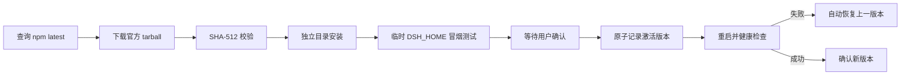

# DHDesk Harness 升级说明

## 使用方式

1. 启动 DHDesk。
2. 选择菜单 `Harness > 检查 Harness 更新…`，或按 `⌘⇧U`。
3. 发现新版本后点击“下载并验证”。当前 Harness 会继续运行。
4. 验证完成后点击“重启并使用”。如果暂时不想切换，直接关闭更新窗口即可。

## 更新流程

## 文件位置

- 已安装 Runtime：`~/Library/Application Support/DHDesk/runtimes/<version>/`
- 激活记录：`~/Library/Application Support/DHDesk/active-runtime.json`
- npm 缓存：`~/Library/Application Support/DHDesk/npm-cache/`
- 运行日志：`~/Library/Logs/DHDesk/harness.log`
- Harness 用户数据：`~/.dsh/`

Runtime 与用户数据分离。下载安装和失败清理只操作 DHDesk 的应用数据目录，不修改 `~/.dsh`。

## 安全和恢复策略

- Registry 默认固定为 `https://registry.npmjs.org`，自定义 Registry 必须使用 HTTPS；本机测试地址除外。
- Registry 元数据必须属于 `@deepseek-ai/dsh`，且必须提供有效的 SHA-512 integrity 和 HTTPS tarball 地址。
- 下载包最大 100 MB，安装默认最多等待 8 分钟。
- 每个版本使用独立目录，安装失败会删除临时目录，不覆盖正在使用的 Runtime。
- 新版本必须通过目录结构、`dsh --version`、本地 Web 启动及 HTTP 健康检查。
- 切换记录使用临时文件加原子重命名写入。首次正式启动失败时恢复上一托管版本；没有上一托管版本时恢复应用内置版本。
- 应用包始终携带一个出厂 Runtime，可在托管 Runtime 不可用时兜底。

## 当前边界

- 更新由用户手动检查，不在应用启动时自动下载或安装。
- 当前通道为 npm `latest`，尚未提供稳定版/预览版通道切换。
- 已安装旧版本暂不自动清理，也没有手动版本选择界面。
- DHDesk 不会自动备份或恢复 `~/.dsh`。如果未来 Harness 版本迁移用户数据格式，需要单独设计带用户确认的数据恢复流程。
