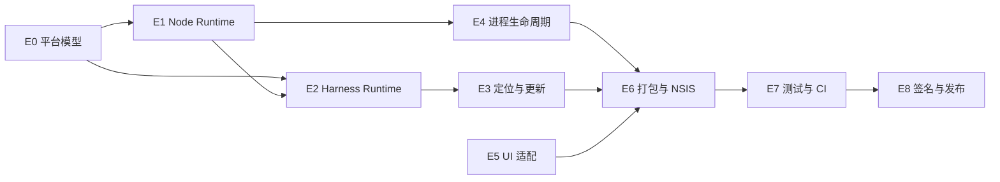

# DHDesk 双平台支持需求拆分

> 来源：`docs/windows-support-plan.md`  
> 目标平台：macOS arm64 + Windows x64  
> 对应分支：`feature/windows-support`  
> 文档状态：待实施  
> 最后更新：2026-08-14

## 1. 拆分目标

本文档将双平台支持方案拆成可独立开发、测试和提交的需求单元。每个需求必须具备明确输入、产出、依赖和验收标准，不以“代码已编写”作为完成条件。

优先级定义：

| 优先级 | 含义 |
|---|---|
| P0 | Windows 首个可运行安装包的阻塞项 |
| P1 | 双平台持续构建和质量保障项 |
| P2 | 正式对外发布前完成 |

### 1.1 当前实施状态

> 状态更新时间：2026-08-14

| Epic | 当前状态 | 已完成 | 仍需验证/决策 |
|---|---|---|---|
| E0 平台模型 | 已实现 | 共享平台布局、Runtime 标记读写与严格校验、单元测试 | Windows CI 回归 |
| E1 Node Runtime | macOS 已验证 | 双平台下载/校验/解压逻辑，macOS arm64 自检通过 | Windows x64 原生下载和自检 |
| E2 Harness Runtime | macOS 已验证 | 内置 Node/npm 安装、原生依赖检查、平台标记、Web 冒烟测试 | Windows x64 原生模块和 Web 冒烟测试 |
| E3 定位与更新 | 已实现 | 双平台路径、Node 身份检查、Updater 标记校验/补写、无效 Runtime 重装 | Windows 应用内真实升级/回滚 |
| E4 进程生命周期 | 已实现 | `windowsHide`、统一进程树终止、taskkill 参数及原生进程终止测试 | Windows 下无闪窗、无 `conhost.exe` 残留验收 |
| E5 UI 适配 | 已实现平台分支 | macOS/Windows 菜单分支、macOS 窗口按钮 API 隔离 | Windows 高 DPI 和按钮命中手工验收 |
| E6 打包与 NSIS | macOS 已验证 | builder 配置拆分、`extends` 合并、平台资源过滤、多尺寸 ICO、DMG 构建 | Windows NSIS 原生构建；DEC-001 最终确认 |
| E7 测试与 CI | 已配置待运行 | 25 个本地测试、双平台 GitHub Actions、SHA-256 产物文件 | 推送后观察 macOS/Windows 两个 Job |
| E8 签名发布 | 未开始 | 无 | Developer ID 公证、Windows 签名方案和分发渠道 |

“已实现”表示代码与本地自动化检查完成，不等于 Windows 原生验收完成。Windows 相关需求只有在目标 Runner 或干净 Windows 机器通过后才能勾选最终验收项。

## 2. 交付范围

### 2.1 本期交付

- macOS arm64 的现有启动、Harness 更新和 DMG 构建能力保持可用。
- Windows 10 22H2/Windows 11 x64 可安装、启动、更新 Harness 和卸载。
- 两个平台均内置 Node.js 和出厂 Harness Runtime，用户无需安装系统 Node/npm。
- 两个平台使用同一套业务代码，但 Runtime、原生依赖和安装包必须在目标平台原生构建。
- Harness 更新失败或新版本启动失败时，保留当前可用版本并支持回滚。
- Windows 应用退出后不残留 Harness、Node 或控制台进程。

### 2.2 不在本期

- Windows arm64、Intel Mac。
- Microsoft Store、Mac App Store、Windows portable 版本。
- DHDesk 自身自动更新。
- Harness 历史版本管理页面。
- 自动备份、迁移或恢复 `.dsh` 用户数据。

## 3. Epic 与依赖关系

| Epic | 名称 | 优先级 | 依赖 | 主要交付物 |
|---|---|---|---|---|
| E0 | 平台模型与 Runtime 元数据 | P0 | 无 | 统一平台布局、`runtime-platform.json` 校验能力 |
| E1 | Node Runtime 平台化 | P0 | E0 | macOS/Windows 对应的内置 Node Runtime |
| E2 | 出厂 Harness Runtime 平台化 | P0 | E0、E1 | 目标平台原生 Harness Runtime |
| E3 | Runtime 定位与 Harness 更新 | P0 | E0、E2 | 正确定位、升级、切换和回滚 Runtime |
| E4 | Windows 进程生命周期 | P0 | E1 | 无控制台闪窗、无残留进程 |
| E5 | Electron 平台界面适配 | P0 | 无 | Windows 菜单、窗口和高 DPI 可用 |
| E6 | 双平台打包与 NSIS | P0 | E1、E2、E4、E5 | DMG 与 Windows Setup EXE |
| E7 | 自动化测试与 CI | P1 | E1–E6 | 双平台原生构建、测试和产物验证 |
| E8 | 签名与正式发布 | P2 | E6、E7 | macOS 公证包、Windows 签名安装包 |

## 4. 详细需求

### E0：平台模型与 Runtime 元数据

#### WIN-PLAT-001：统一平台布局模型

- 优先级：P0
- 目标：让准备脚本、Runtime Locator、Updater 和打包配置使用同一套平台路径约定。
- 影响范围：`scripts/`、`src/main/runtime-locator.ts`，必要时新增共享模块。
- 开发任务：
  - [ ] 定义受支持目标：`darwin-arm64`、`win32-x64`。
  - [ ] 定义各平台 Node 可执行文件和 npm CLI 相对路径。
  - [ ] 将平台布局解析实现为可单元测试的纯函数。
  - [ ] 对不支持的平台或架构返回包含平台、架构的明确错误。
- 验收标准：
  - [ ] 两种目标返回文档约定的正确路径。
  - [ ] 其他平台/架构不会静默回退。
  - [ ] 路径解析不依赖当前工作目录和字符串拼接分隔符。

#### WIN-PLAT-002：Runtime 平台标记模型

- 优先级：P0
- 依赖：WIN-PLAT-001
- 目标：禁止 macOS Runtime 被装入 Windows 包，或错误架构 Runtime 被激活。
- 开发任务：
  - [ ] 定义 `runtime-platform.json` 的结构和读写函数。
  - [ ] 校验 `platform`、`arch`、`nodeVersion`、`harnessVersion`。
  - [ ] 区分“文件缺失”“格式错误”“平台不匹配”和“版本不匹配”。
  - [ ] 日志只输出诊断信息，不输出环境变量或用户凭据。
- 验收标准：
  - [ ] 合法标记通过校验。
  - [ ] 平台、架构或版本任一不匹配时拒绝激活。
  - [ ] 损坏 JSON 不导致主进程未捕获异常。

### E1：Node Runtime 平台化

#### WIN-NODE-001：Node 下载目标平台化

- 优先级：P0
- 依赖：WIN-PLAT-001
- 影响文件：`scripts/prepare-node-runtime.mjs`
- 开发任务：
  - [ ] macOS arm64 使用 `.tar.xz` 发行包。
  - [ ] Windows x64 使用官方 `.zip` 发行包。
  - [ ] 下载目标由当前构建主机的平台和架构确定。
  - [ ] 禁止在 macOS 准备 Windows Runtime，反之亦然。
- 验收标准：
  - [ ] 两个平台均解析出正确的官方文件名和下载地址。
  - [ ] 不支持的构建主机在下载前失败。

#### WIN-NODE-002：校验、解压和目录归一化

- 优先级：P0
- 依赖：WIN-NODE-001
- 开发任务：
  - [ ] 下载并解析 Node 官方 `SHASUMS256.txt`。
  - [ ] 下载文件执行 SHA-256 校验，失败时删除不可信缓存。
  - [ ] macOS 解压后维护 `bin/npm`、`bin/npx` 符号链接。
  - [ ] Windows 保留 `node.exe` 和 `node_modules/npm` 官方 zip 布局。
  - [ ] `npm.cmd`、`npx.cmd` 只为资源完整性和调试保留，业务代码不得依赖 shell 调用它们。
- 验收标准：
  - [ ] 修改缓存文件任一字节后，准备脚本拒绝使用该文件。
  - [ ] 重复执行脚本具有幂等性。
  - [ ] 准备失败不会留下可被下次误识别为成功的半成品目录。

#### WIN-NODE-003：目标 Node 自检

- 优先级：P0
- 依赖：WIN-NODE-002
- 开发任务：
  - [ ] 执行准备后的内置 Node。
  - [ ] 断言 `process.platform`、`process.arch` 和 Node 版本。
  - [ ] 自检通过后才将目录视为可打包资源。
- 验收标准：
  - [ ] macOS 输出 `darwin/arm64`。
  - [ ] Windows 输出 `win32/x64`。
  - [ ] 自检失败时构建退出码非 0。

### E2：出厂 Harness Runtime 平台化

#### WIN-HARNESS-001：使用内置 Node/npm 安装 Harness

- 优先级：P0
- 依赖：WIN-NODE-003
- 影响文件：`scripts/prepare-harness-runtime.mjs`
- 开发任务：
  - [ ] 根据平台布局解析 Node 和 `npm-cli.js`。
  - [ ] 通过 `<node> <npm-cli.js>` 执行安装，不调用 `npm.cmd`/`npx.cmd`。
  - [ ] 禁止回退到 PATH 中的系统 Node 或 npm。
  - [ ] Harness 版本继续读取 `resources/runtime-manifest.json`。
- 验收标准：
  - [ ] 清空系统 PATH 中的 Node/npm 后仍能准备 Runtime。
  - [ ] 安装日志能识别使用的是项目内置 Node。

#### WIN-HARNESS-002：原生依赖与版本校验

- 优先级：P0
- 依赖：WIN-HARNESS-001
- 开发任务：
  - [ ] 校验安装后的 Harness 包版本。
  - [ ] 执行 `dsh --version`。
  - [ ] macOS 检查 sharp/koffi 的 darwin-arm64 依赖。
  - [ ] Windows 检查 sharp/koffi 的 win32-x64 依赖和 node-pty win32-x64 prebuild。
- 验收标准：
  - [ ] 缺少任一目标平台原生依赖时构建失败。
  - [ ] Runtime 中不存在会优先加载的错误平台同名依赖。

#### WIN-HARNESS-003：写入标记并执行出厂冒烟测试

- 优先级：P0
- 依赖：WIN-HARNESS-002、WIN-PLAT-002
- 开发任务：
  - [ ] 安装和校验完成后写入 `runtime-platform.json`。
  - [ ] 使用临时 `DSH_HOME` 启动 Harness Web 服务。
  - [ ] 使用动态端口完成 HTTP 健康检查。
  - [ ] 成功或失败后均清理测试进程和临时目录。
- 验收标准：
  - [ ] 标记内容与实际 Runtime 一致。
  - [ ] 健康检查通过后构建才可继续。
  - [ ] 冒烟测试结束后没有 Node/Harness 残留进程。

### E3：Runtime 定位与 Harness 更新

#### WIN-RUNTIME-001：跨平台 Runtime Locator

- 优先级：P0
- 依赖：WIN-PLAT-001、WIN-HARNESS-003
- 影响文件：`src/main/runtime-locator.ts`
- 开发任务：
  - [ ] 支持 macOS Node/npm 路径。
  - [ ] 支持 Windows Node/npm 路径。
  - [ ] 同时覆盖开发环境和打包后的 `process.resourcesPath`。
  - [ ] Runtime 不完整或不匹配时回退到有效的内置 Runtime。
- 验收标准：
  - [ ] 开发态和安装态均找到正确的 Node、npm CLI 和 Harness 入口。
  - [ ] 不会选择其他平台或损坏的 Runtime。

#### WIN-RUNTIME-002：Updater 写入并校验平台标记

- 优先级：P0
- 依赖：WIN-PLAT-002、WIN-RUNTIME-001
- 影响文件：`src/main/harness-updater.ts`
- 开发任务：
  - [ ] 新版本在 staging 目录安装完成后写入平台标记。
  - [ ] 在原子切换前重新校验平台、架构、Node 版本和 Harness 版本。
  - [ ] 校验失败时删除 staging，保留当前激活版本。
  - [ ] 记录可用于诊断的失败阶段和错误类别。
- 验收标准：
  - [ ] 错误平台 Runtime 永远不会进入正式版本目录或激活记录。
  - [ ] 安装、校验或切换失败不影响当前版本启动。

#### WIN-RUNTIME-003：兼容无平台标记的旧 Runtime

- 优先级：P0
- 依赖：WIN-RUNTIME-002
- 开发任务：
  - [ ] 检测旧版 DHDesk 创建的无标记 Runtime。
  - [ ] 对其执行版本、Node 平台和原生依赖完整性校验。
  - [ ] 校验通过后补写标记；失败时回退，不直接覆盖或激活。
- 验收标准：
  - [ ] 单纯缺少标记不会破坏已有可用安装。
  - [ ] 无法证明平台正确的旧 Runtime 不会被继续使用。

#### WIN-RUNTIME-004：跨平台更新回滚回归

- 优先级：P0
- 依赖：WIN-RUNTIME-002
- 开发任务：
  - [ ] 覆盖下载失败、校验失败、npm 安装失败和冒烟测试失败。
  - [ ] 覆盖新版本首次正式启动失败后的自动回滚。
  - [ ] 验证 Windows 文件锁存在时不会破坏当前版本。
- 验收标准：
  - [ ] 每类失败均能重新启动原有效版本。
  - [ ] 激活记录与磁盘实际版本一致。

### E4：Windows 进程生命周期

#### WIN-PROC-001：隐藏 Windows 子进程控制台

- 优先级：P0
- 影响文件：`src/main/process-supervisor.ts`、`src/main/harness-updater.ts`
- 开发任务：
  - [ ] 两处所有 Node/npm `spawn()` 设置 `windowsHide: process.platform === "win32"`。
  - [ ] 覆盖 Harness 正常启动、npm 安装和更新冒烟测试进程。
- 验收标准：
  - [ ] Windows 启动应用和执行 Harness 更新时不闪现控制台窗口。
  - [ ] macOS 现有启动行为不变。

#### WIN-PROC-002：统一进程树终止接口

- 优先级：P0
- 依赖：WIN-PROC-001
- 开发任务：
  - [ ] 抽取 `terminateProcessTree()`。
  - [ ] macOS 保留进程组 `SIGTERM`、超时后 `SIGKILL`。
  - [ ] 明确 Windows `child.kill("SIGTERM")` 是目标进程终止，不是优雅退出协议。
  - [ ] Windows 超时后使用 `taskkill /PID <pid> /T /F` 或等价可靠方案结束完整进程树。
  - [ ] 终止命令参数不经 shell 拼接。
- 验收标准：
  - [ ] 普通退出、启动失败、更新取消和应用崩溃恢复路径共用同一终止策略。
  - [ ] 终止不存在或已退出的 PID 不导致应用崩溃。

#### WIN-PROC-003：残留进程验证

- 优先级：P0
- 依赖：WIN-PROC-002
- 开发任务：
  - [ ] 检查应用退出后的 Harness、`node.exe`、npm/node-gyp 和生命周期脚本进程。
  - [ ] 检查是否存在由本应用启动后遗留的 `conhost.exe`。
  - [ ] 覆盖正常退出、强制退出、安装超时和冒烟测试超时。
- 验收标准：
  - [ ] 所有测试场景均不留下由 DHDesk 创建的子进程。
  - [ ] 不终止与 DHDesk 无关的系统 Node 进程。

### E5：Electron 平台界面适配

#### WIN-UI-001：窗口与菜单平台分支

- 优先级：P0
- 影响文件：`src/main/app.ts`、`src/main/window-manager.ts`
- 开发任务：
  - [ ] macOS 窗口按钮 API 只在 darwin 调用。
  - [ ] macOS 保留 About、Hide、Hide Others 等系统菜单。
  - [ ] Windows 菜单只显示有效操作和标准快捷键。
  - [ ] 更新入口快捷键在两平台分别显示正确修饰键。
- 验收标准：
  - [ ] Windows 启动时无 macOS 专属 API 异常。
  - [ ] 两个平台均可通过菜单和快捷键打开 Harness 更新窗口。

#### WIN-UI-002：高 DPI 与 Web UI 点击位置

- 优先级：P0
- 依赖：WIN-UI-001
- 开发任务：
  - [ ] 验证 100%、125%、150%、200% 显示缩放。
  - [ ] 验证主 Web UI 与更新窗口的视觉位置和实际点击区域一致。
  - [ ] 验证窗口缩放、最大化和多显示器切换后的命中区域。
- 验收标准：
  - [ ] 可见按钮无需偏移鼠标即可点击。
  - [ ] 不通过为某一 DPI 写死坐标修复问题。

#### WIN-UI-003：导航与安全边界回归

- 优先级：P0
- 开发任务：
  - [ ] 外部 HTTP/HTTPS 链接仍交由系统浏览器打开。
  - [ ] Harness 主窗口只允许导航到已启动的本地服务。
  - [ ] Renderer 继续保持 Node Integration 关闭、Context Isolation 和 Sandbox 开启。
- 验收标准：
  - [ ] Windows 适配没有扩大 Renderer 权限或本地服务导航范围。

### E6：双平台打包与 NSIS

#### WIN-PKG-001：拆分 electron-builder 配置

- 优先级：P0
- 开发任务：
  - [ ] 新建 `electron-builder.base.yml`、`electron-builder.mac.yml` 和 `electron-builder.win.yml`。
  - [ ] macOS/Windows 配置分别通过 `extends: electron-builder.base.yml` 继承基础配置。
  - [ ] 不依赖默认 `electron-builder.yml` 自动加载。
  - [ ] 不使用多个 `-c` 参数模拟配置合并。
- 验收标准：
  - [ ] 两个平台的最终配置均包含相同的 `appId`、`asar` 和公共 `extraResources`。
  - [ ] 分离配置后 macOS DMG 内容与现有功能一致。

#### WIN-PKG-002：平台资源过滤

- 优先级：P0
- 依赖：WIN-PKG-001、WIN-HARNESS-003
- 开发任务：
  - [ ] macOS 仅携带 darwin-arm64 Node 和原生模块。
  - [ ] Windows 仅携带 win32-x64 Node 和原生模块。
  - [ ] Windows 保留 node-pty win32-x64 prebuild。
  - [ ] 两个平台均携带出厂 Harness Runtime 和 Runtime 标记。
- 验收标准：
  - [ ] 解包检查不存在会被误加载的其他平台二进制。
  - [ ] 安装包中的 Runtime 标记与构建目标一致。

#### WIN-PKG-003：Windows 图标与应用元数据

- 优先级：P0
- 开发任务：
  - [ ] 由现有蓝鲸飞船图标源生成多尺寸 `.ico`。
  - [ ] Windows EXE、安装器、桌面快捷方式和开始菜单图标一致。
  - [ ] 产品描述改为同时覆盖 macOS 和 Windows。
- 验收标准：
  - [ ] 常用 Windows 缩放下图标清晰且无黑底、白边。
  - [ ] 文件属性中的产品名和版本正确。

#### WIN-PKG-004：双平台构建命令

- 优先级：P0
- 依赖：WIN-PKG-001
- 开发任务：
  - [ ] 增加 `package:dir:mac`、`package:dir:win`、`package:dmg`、`package:nsis`。
  - [ ] 每个命令只传入对应平台配置文件。
  - [ ] 产物名包含版本、平台和架构。
- 验收标准：
  - [ ] macOS 原生环境生成 arm64 DMG。
  - [ ] Windows 原生环境生成 x64 NSIS Setup EXE。
  - [ ] 构建脚本不会从一个平台交叉准备另一个平台 Runtime。

#### WIN-PKG-005：NSIS 安装与卸载策略

- 优先级：P0
- 依赖：WIN-PKG-002、WIN-PKG-003、DEC-001
- 开发任务：
  - [ ] 默认按当前用户安装，不要求管理员权限。
  - [ ] 创建开始菜单和桌面快捷方式。
  - [ ] 同一 `appId`/安装 GUID 支持覆盖升级。
  - [ ] 默认卸载不删除 `%APPDATA%\DHDesk` 和 `%USERPROFILE%\.dsh`。
  - [ ] 验证安装目录和用户名包含中文、空格的场景。
- 验收标准：
  - [ ] 干净 Win10/Win11 无 Node 环境可完成安装、启动和卸载。
  - [ ] 覆盖安装后 Harness 配置和会话保持。
  - [ ] 卸载后用户 `.dsh` 数据仍存在。

### E7：自动化测试与 CI

#### WIN-TEST-001：平台逻辑单元测试

- 优先级：P1
- 依赖：E0–E6 中对应实现
- 开发任务：
  - [ ] 平台到 Node/npm 路径映射测试。
  - [ ] Runtime 标记读取、损坏和平台不匹配测试。
  - [ ] Windows 进程树终止参数测试。
  - [ ] Updater 切换与回滚测试。
  - [ ] 打包资源过滤规则测试。
- 验收标准：
  - [ ] `npm test` 和 `npm run typecheck` 在两个平台通过。
  - [ ] 测试不依赖开发者机器上的系统 Node 路径或用户 `.dsh`。

#### WIN-TEST-002：目标平台集成测试

- 优先级：P1
- 依赖：WIN-TEST-001
- 开发任务：
  - [ ] 执行内置 Node 版本/架构检查。
  - [ ] 执行出厂 Harness 版本和 Web 健康检查。
  - [ ] 执行 Harness 更新、激活、失败回滚测试。
  - [ ] 执行退出后的残留进程检查。
- 验收标准：
  - [ ] 测试使用隔离的临时 `DSH_HOME`。
  - [ ] 测试失败后仍完成进程和临时数据清理。

#### WIN-CI-001：GitHub Actions 双平台矩阵

- 优先级：P1
- 依赖：WIN-PKG-004、WIN-TEST-002
- 开发任务：
  - [ ] macOS arm64 Runner 准备 Runtime、测试并打包 DMG。
  - [ ] Windows x64 Runner 准备 Runtime、测试并打包 NSIS EXE。
  - [ ] Job 开始时断言操作系统和架构。
  - [ ] Runtime 缓存 key 包含 OS、架构、Node 版本、Harness 版本。
  - [ ] 禁止跨平台共享 `resources/node` 和 `bundled-runtime` 缓存。
  - [ ] 上传安装产物及 SHA-256 文件。
- 验收标准：
  - [ ] Pull Request 中两平台检查均为必需项。
  - [ ] 任一平台失败时不创建完整 Release。
  - [ ] CI 日志不输出 Token、证书密码或用户凭据。

### E8：签名与正式发布

#### WIN-REL-001：macOS 正式签名与公证

- 优先级：P2
- 依赖：WIN-CI-001
- 开发任务：
  - [ ] 使用 Developer ID Application 证书。
  - [ ] 启用 Hardened Runtime 和 entitlements。
  - [ ] 签名 Node sidecar、Electron Framework 和嵌套原生模块。
  - [ ] 完成 Notarization 和 Stapling。
  - [ ] CI 安全注入证书和公证凭据。
- 验收标准：
  - [ ] `codesign --verify --deep --strict` 通过。
  - [ ] Gatekeeper 验证和干净机器安装通过。

#### WIN-REL-002：Windows 代码签名

- 优先级：P2
- 依赖：WIN-CI-001、DEC-002
- 开发任务：
  - [ ] 接入 OV/EV 代码签名证书或 Azure Trusted Signing。
  - [ ] 对主 EXE、Helper、Node sidecar 和 NSIS 安装器签名。
  - [ ] 使用可信时间戳服务。
  - [ ] 签名凭据只存在于 CI Secret 或受控签名服务。
- 验收标准：
  - [ ] 安装前后 Authenticode 状态有效。
  - [ ] 修改已签名文件后验证失败。

#### WIN-REL-003：双平台 Release

- 优先级：P2
- 依赖：WIN-REL-001、WIN-REL-002、DEC-003
- 开发任务：
  - [ ] 同一版本发布 DMG、NSIS Setup EXE 和 SHA-256 文件。
  - [ ] Release Notes 说明支持的平台、架构和 Harness 出厂版本。
  - [ ] 发布前完成双平台手工验收。
- 验收标准：
  - [ ] 两个平台安装包版本一致。
  - [ ] 下载后的校验和、签名和安装验证全部通过。

## 5. 待确认决策

### DEC-001：NSIS 安装模式

- 候选：one-click 或允许选择安装目录的 assisted。
- 最晚确认时间：开始 WIN-PKG-005 前。
- 不阻塞：E0–E5 和 WIN-PKG-001～004。

### DEC-002：Windows 正式签名方案

- 候选：OV/EV 证书或 Azure Trusted Signing。
- 最晚确认时间：开始 WIN-REL-002 前。
- 不阻塞：未签名 Windows 内测包。

### DEC-003：正式分发渠道

- 候选：GitHub Releases 或自有下载渠道。
- 最晚确认时间：开始 WIN-REL-003 前。

### DEC-004：DHDesk 自更新排期

- 当前结论：不属于本期双平台支持。
- 要求：Harness Runtime 更新与 DHDesk 应用更新继续保持独立。

## 6. 推荐实施批次

| 批次 | 需求 | 完成标志 |
|---|---|---|
| B1：平台基础 | WIN-PLAT-001～002 | 平台路径和 Runtime 标记测试通过 |
| B2：Runtime 构建 | WIN-NODE-001～003、WIN-HARNESS-001～003 | 两平台原生 Runtime 可准备并通过冒烟测试 |
| B3：运行时适配 | WIN-RUNTIME-001～004、WIN-PROC-001～003 | Windows 可稳定启动、升级、回滚和退出 |
| B4：桌面与安装包 | WIN-UI-001～003、WIN-PKG-001～005 | 产出首个 Windows x64 内测安装包，macOS 无回归 |
| B5：质量流水线 | WIN-TEST-001～002、WIN-CI-001 | Pull Request 双平台自动验证 |
| B6：正式发布 | WIN-REL-001～003 | 产出可对外分发的签名 DMG 和 EXE |

## 7. 建议提交边界

每组应能独立评审和回滚：

1. `refactor: add cross-platform runtime layout model`
2. `build: prepare platform-specific node runtime`
3. `build: prepare platform-specific harness runtime`
4. `feat: validate managed runtime platform metadata`
5. `fix: manage Windows child process lifecycle`
6. `feat: adapt Electron UI for Windows`
7. `build: add Windows NSIS packaging`
8. `test: add cross-platform runtime integration coverage`
9. `ci: build macOS and Windows artifacts`
10. `release: add macOS notarization and Windows signing`

不要把 Runtime、进程管理、UI、打包和 CI 的全部改动压进一个提交；这样会使 macOS 回归或 Windows 原生依赖问题难以定位。

## 8. 通用完成定义

每个需求完成时必须同时满足：

- [ ] 代码通过 TypeScript 类型检查和相关自动化测试。
- [ ] 新平台分支包含失败处理和可诊断日志。
- [ ] 不把 API Key、Authorization Header、完整环境变量或签名凭据写入日志。
- [ ] 不依赖用户预装 Node/npm，也不回退到系统 Runtime。
- [ ] 平台相关行为至少在对应原生平台验证一次。
- [ ] 共享代码变更完成 macOS 回归，不宣称“平台分支天然零回归”。
- [ ] 文档、构建命令和实际目录布局保持一致。
- [ ] 应用退出及测试结束后无 DHDesk 创建的残留子进程。

## 9. 首个 Windows 内测包完成标准

以下需求全部完成后，才能交付首个 Windows x64 内测安装包：

- [ ] E0～E6 的全部 P0 需求。
- [ ] 在干净 Windows 10 22H2 和 Windows 11 x64 上安装与启动通过。
- [ ] 无系统 Node/npm 时，出厂 Harness 可离线启动。
- [ ] Harness 应用内更新、失败回滚和重启通过。
- [ ] 100%、125%、150%、200% 显示缩放下按钮命中位置正确。
- [ ] 中文用户名、含空格安装目录和工作区可用。
- [ ] 退出和卸载后无 DHDesk 创建的 `node.exe`、Harness 或 `conhost.exe` 残留。
- [ ] 默认卸载保留 `%USERPROFILE%\.dsh`。
- [ ] macOS arm64 启动、更新和 DMG 构建回归通过。
