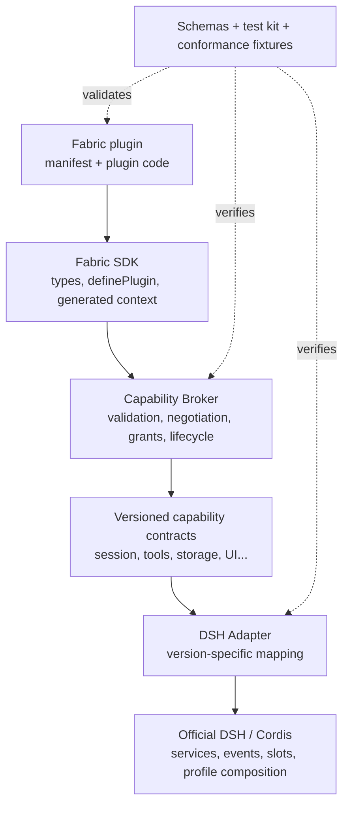

# Fabric Compatibility Layer and Developer Framework

English | [中文](compatibility-layer.zh.md)

Status: Design Draft. This document defines the central product boundary of DSH Community Fabric: how plugins perform real work through stable capabilities without importing official DSH source internals or private services.

## 1. The real problem

A manifest alone is insufficient. If a plugin declares its needs and then imports upstream internals, reads private objects, or patches source, an upstream update still breaks the ecosystem.

Fabric needs a stable middle layer:

```text
Plugin code
  ↓ depends only on Fabric SDK, DTOs, and capabilities
Capability Broker
  ↓ negotiation, grants, lifecycle, resource ownership
Versioned DSH Adapter
  ↓ maps stable contracts to official services, events, slots, and profile composition
Official DSH / Cordis runtime
```

Plugins do not know the concrete DSH version. The Adapter is the only layer allowed to absorb upstream changes. When semantics cannot be preserved, it disables the capability with a reason rather than returning an approximate success.

## 2. Five architecture invariants

1. **Fabric entrypoints depend only on Fabric contracts.** A conforming entrypoint has no runtime dependency on DSH, Cordis, Desktop, or Adapter packages. It receives no upstream implementation object and does not inspect private services or monkey patch official functions. Only the Adapter may import the upstream runtime.
2. **Public boundaries carry stable data only.** APIs use versioned plain DTOs, opaque IDs, and typed errors rather than upstream class instances, database rows, or internal event objects.
3. **Every resource belongs to an activation scope.** Listeners, commands, timers, streams, and background operations are owned and released when that plugin instance deactivates.
4. **Adapters fail closed.** A missing equivalent upstream behavior is `unsupported`, not an approximation through private patches.
5. **Portable core and Host extensions stay separate.** Proven cross-Host behavior uses standard namespaces; tray, Electron, DOM, or TUI keymap behavior uses organization-namespaced extensions.

These are supported-contract and conformance rules. In trusted in-process mode, lint and review can detect direct upstream dependencies, but they cannot act like an operating-system sandbox against malicious code.

## 3. Layer responsibilities



### 3.1 Contracts and schemas

This layer defines machine-readable facts only: Manifest, Host Descriptor, capability names and versions, DTOs, event payloads, error codes, and conformance fixtures. It contains no DSH-version checks or Electron code.

### 3.2 Plugin SDK

The SDK provides types, `definePlugin()`, activation context, AbortSignal, test fakes, and small helpers. It never exports the official Cordis Context or a generic `get(name)` that can retrieve arbitrary Host services.

### 3.3 Capability Broker

The Broker is the framework core. It:

- validates manifests and entrypoints;
- negotiates required and optional capabilities against the Host Descriptor;
- evaluates user and policy grants;
- constructs the minimum activation context;
- owns listeners, commands, timers, streams, and operations;
- aborts, drains, and releases resources during deactivation;
- converts implementation failures to stable Fabric errors;
- records compatibility and audit events without sensitive payloads.

It contains no special cases for a particular DSH release.

### 3.4 DSH Adapter

The Adapter is the only upstream translation layer. Each Adapter release declares an explicit DSH runtime range and maps capabilities to official mechanisms.

Implementation priority is:

1. documented public services, events, slots, routes, and profile composition;
2. published but unstable contracts, pinned and covered by real integration tests;
3. private source paths, monkey patches, or modified upstream files never become stable capabilities. A necessary experiment belongs in an explicit vendor extension.

Adapter tests cover both fake contracts and the real pinned DSH runtime. Upstream upgrades pass the Adapter compatibility matrix before its support range changes.

### 3.5 Host integration

A GUI, Web UI, TUI, or launcher selects and assembles the Broker and Adapter, publishes an honest Host Descriptor, and supplies authorization and error UX. A Host need not implement every capability; missing support is valid, false support is not.

## 4. Scope: what the framework should support

Fabric should not cover everything at once. It starts with the most common and stable 80 percent and expands through versioned modules.

The exact experimental v0.1 surface is deliberately small. `host.info`, `log`, and lifecycle cancellation are baseline context available to every activation. The first negotiated capabilities are `storage.local`, `commands`, and one immutable `messages.observe` event. Everything else in the tables below is a planned candidate, not part of v0.1 until its own contract and fixtures land.

This scope is informed by three source studies rather than an invented API wishlist: [mature plugin framework patterns](../research/mature-plugin-frameworks.md), the detailed [VS Code extension model](../research/vscode-extension-model.md), and [twelve representative DSH plugins](../research/dsh-plugin-needs.md). Those studies also define the seams that v0.1 must preserve for later Host/Client faces, typed renderers, cross-face messaging, interceptors, context contributions, and mediated system access.

[Community Issue #23](https://github.com/omdsh-dev/community/issues/23) supplied concrete counterexamples after this architecture was drafted. The [disposition record](../research/community-issue-23-review.md) explains each decision. Follow-up Drafts now isolate [Runtime/Presentation invocation](../rfcs/0002-runtime-presentation-invocation-transport.md), [service composition](../rfcs/0003-service-providers-and-composition.md), and [provenance plus effect ownership](../rfcs/0004-provenance-validation-and-diagnostics.md) so none of them silently expands the experimental v0.1 contract.

### 4.1 Portable Core

| Capability | Operations | Constraints |
| --- | --- | --- |
| `host.info` | Host ID/version/platform, standard versions, execution mode. | Read-only, no upstream objects. |
| `log` | Structured debug/info/warn/error. | Plugin ID attached; no sensitive payload by default. |
| `lifecycle` | Activation signal, deactivation, health state. | Resources belong to activation scope. |
| `storage.local` | Plugin-private get/set/delete/list. | Quota, schema version, plugin namespace. |
| `settings.schema` | Declare settings, read granted values, observe changes. | Host renders UI; no DOM access. |
| `commands` | Bind handlers to commands declared in the manifest. | IDs belong to the plugin namespace; discoverable metadata has one source of truth. |

`storage.local` is a Broker-owned, plugin-namespaced KV contract backed by a narrow persistence port. A DSH Adapter must not expose an upstream storage hub or database object as its implementation.

### 4.2 DSH domain capabilities

| Capability | Planned operations | Evidence required before stability |
| --- | --- | --- |
| `sessions.read` | List/get canonical snapshots, paginate, observe create/close. | DTO, pagination, privacy redaction, cross-version mapping. |
| `messages.observe` | Immutable sent/received observation. | Per-session order, backpressure, sensitive scopes. |
| `sessions.actions` | Create, send, cancel, resume. | Grants, idempotency, operation outcomes, recovery. |
| `tools.register` | Register schema-defined tools with cancellation. | I/O schemas, timeout, audit, repeated-call semantics. |
| `tools.observe` | Observe started/result/failed. | Redaction, identity, event order. |
| `models.read` | Read redacted model capabilities and selection. | Never expose credentials or provider internals. |
| `models.provider` | Register a model provider. | Separate RFC for streams, tools, usage, and errors. |
| `profiles.read` | Read current and available work profiles. | May be unsupported where Host has no profile concept. |
| `profiles.select` | Request an ordered switch. | Consent, restart boundary, rollback. |

Read-only session data can still be highly sensitive. It needs explicit grants, scopes, and redaction rather than being labeled low-risk merely because it does not mutate state.

### 4.3 UI extension layers

UI is not one universal renderer. Fabric separates four layers:

1. **Declarative contributions** for commands, settings schemas, menus, status, notifications, theme tokens, and small forms. The Host owns presentation, localization, accessibility, ordering, and conflicts.
2. **Typed providers and named renderers** for tool results, message content, composer accessories, file viewers, session trees, and similar domain surfaces. Each extension point defines input DTOs, cardinality, priority, fallback, and lifecycle.
3. **Sandboxed rich views** for GenUI, dashboards, editors, visualizations, or complete workbenches. They use a separate Client/Worker face, a versioned message bridge, approved resources, theme tokens, and explicit Host placement.
4. **Host extensions** for raw DOM, Electron, native widgets, terminal protocols, and other behavior without portable semantics.

High-portability candidates include `ui.notification`, `ui.status`, settings schemas, command metadata, and small forms. A common `ui.panel.basic` remains a later prototype, not proof that arbitrary GUI UI can run unchanged in a TUI.

Fabric does not expose raw DOM, React components, Electron BrowserWindow, or TUI screen handles in its portable API. Rich views and Host extensions need separate specifications and honest compatibility labels.

### 4.4 Business behavior protocols

Fabric does not use one stringly typed event bus for every operation:

- **immutable observation streams** report canonical message, session, tool, or job facts without changing the source operation;
- **commands and actions** are authorized request/result operations with cancellation, idempotency, stable errors, and audit identity;
- **ordered interceptor pipelines** may allow, deny, or narrowly rewrite an operation only after ordering, timeout, failure, conflict, privacy, and reentrancy semantics are specified;
- **context-contribution pipelines** collect bounded, attributable, budgeted memory or instruction fragments and freeze the result before execution;
- **durable jobs** define identity, progress, checkpoint, cancellation, retry, ownership, and restart behavior.

Only immutable `messages.observe` belongs to v0.1. Interceptors, context contributions, and jobs require independent RFCs and conformance fixtures.

### 4.5 Sensitive mediated capabilities

`net.fetch`, `workspace.read/write`, clipboard, secrets, process, terminal, and package management are mediated operations: scoped input, bounded output, cancellation, audit, and renewed consent when permissions expand.

In trusted in-process mode, those grants still are not a hard sandbox. Real enforcement requires isolated execution. Raw shell, unrestricted process spawning, raw Electron, and unrestricted filesystem access do not belong to Portable Core.

### 4.6 Host extensions

Behavior without cross-Host semantics uses organization namespaces:

- `x-ai.anywhere.desktop.tray`
- `x-org.example.tui.keymap`
- `x-org.example.web.panel`

Extensions still have schemas, versions, and lifecycle rules but are not described as ecosystem-portable. Standardization requires real implementations from at least two independent Hosts.

## 5. Canonical DTOs isolate upstream change

Plugins receive Fabric DTOs, never official class instances or database shapes. DTOs are:

- JSON/structured-clone serializable;
- schema- and version-defined;
- based on opaque IDs rather than parseable internal paths or keys;
- explicit about time, pagination, ordering, and missing values;
- bounded by default and cursor-paginated;
- data-minimized, expanding only with grants;
- immutable in events;
- explicit operation outcomes for mutations rather than internal controllers;
- backed by stable errors such as `unsupported`, `permission-denied`, `aborted`, `conflict`, and `upstream-unavailable`.

The Adapter converts upstream data in both directions. If conversion loses required semantics, it removes the capability from the Host Descriptor.

## 6. Target developer experience

These are target shapes, not published commands or APIs.

### 6.1 Project layout

```text
my-fabric-plugin/
  dsh-plugin.json          # the single static declaration
  src/index.ts             # imports only the Fabric SDK
  tests/plugin.spec.ts
  package.json
```

### 6.2 Workflow

```sh
yarn dlx dsh-community-fabric init
yarn fabric validate       # schema, ID, entrypoint, capability versions
yarn fabric generate       # exact context types from the manifest
yarn fabric test           # fake Host, lifecycle, capability fixtures
yarn fabric dev --host web # connect to an explicit development Host integration
yarn fabric pack           # static manifest and inspectable package
```

Names are not frozen. The invariant is that one manifest drives validation, generated types, market compatibility, and Host negotiation without duplicated configuration.

### 6.3 Plugin code

```ts
import { definePlugin } from 'dsh-community-fabric/sdk'

export default definePlugin(async (ctx) => {
  ctx.commands.handle('com.example.hello.open', async () => {
    ctx.log.info('Hello from Fabric')
  })

  ctx.messages.onReceived(async (message) => {
    await ctx.storage.local.set('lastMessageId', message.id)
  })

  // Registrations are activation-scoped and released automatically.
  // ctx.signal aborts when this instance deactivates.
})
```

This demonstrates the intended shape only. The manifest owns command metadata; code only binds a handler by ID. The SDK context is generated from the manifest: undeclared capabilities do not exist in its type and fail at runtime. Optional capabilities remain optional members until `ctx.capabilities.has(name)` narrows them. There is no unnegotiated `ctx.get(anyName)` escape hatch.

The v0.1 manifest-to-SDK mapping has one canonical path:

| Contract item | SDK member |
| --- | --- |
| baseline `host.info` | `ctx.host` |
| baseline `log` | `ctx.log` |
| baseline lifecycle cancellation | `ctx.signal` |
| `storage.local` | `ctx.storage.local` |
| `commands` | `ctx.commands.handle(id, handler)` |
| `messages.observe` | `ctx.messages.onReceived(handler)` |

Capability IDs describe negotiated contracts; SDK member names provide ergonomic typed access. This mapping is generated rather than reconfigured by each plugin.

### 6.4 Understandable failures

Plugin authors and users should not receive upstream stack traces or internal service names. Stable failures cover invalid manifests, incompatible API ranges, missing required capabilities, denied grants, temporarily unavailable adapters, aborted/timed-out/conflicting operations, and activation failures.

Every failure has a machine code, developer detail, and localizable user summary without leaking tokens, message text, or local paths. Adapter diagnostics retain the original upstream cause behind a correlation ID in Host-owned logs; that cause never crosses into the plugin-facing contract.

## 7. Host and Adapter developer experience

Host maintainers should not reimplement manifest parsing, SemVer, grant state machines, or lifecycle ownership. Future reference modules may be organized as:

```text
schema/        static schemas and validators; no Host or DSH dependency
contract/      DTOs, errors, capability interfaces, and Adapter SPI
sdk/           definePlugin and generated plugin-side context
broker/        negotiation, grants, activation scope, and resource ownership
dsh-adapter/   the only layer allowed to import DSH/Cordis runtime packages
testkit/       headless fixtures and shared conformance suites
cli/           init, validate, generate, test, and pack
```

Exact package names and subpaths remain unfrozen. `dsh-community-fabric` may be a lightweight plugin-facing entry, but it must not re-export the Broker or Adapter by default. Dependency direction stays one-way: schemas have no Host dependency; contracts depend only on schemas; the SDK depends on contracts; the Broker depends on schemas and contracts but not DSH; only `dsh-adapter` imports upstream runtime packages. Production Host Descriptors belong to the schema/contract boundary, while authorization is a Broker responsibility rather than a test-kit feature.

Tools generate the Host Descriptor from registered implementations to prevent documentation drift. Each capability implementation runs the shared headless contract suite from `testkit`; real DSH integration tests remain owned by `dsh-adapter`. A complete Host additionally runs lifecycle and cross-capability integration tests.

## 8. Versions and upstream upgrades

Adapters maintain an explicit matrix:

| Fabric API | Adapter | DSH runtime | Status |
| --- | --- | --- | --- |
| 0.1.x | adapter-dsh 0.1.x | explicit range | experimental / tested / unsupported |

Upgrade flow:

1. pin the new upstream release and run real Adapter contract tests;
2. inspect DTO and behavior semantics for every capability;
3. update only mappings whose semantics remain valid;
4. remove unsupported capabilities from the Host Descriptor with migration notes;
5. change the standard contract only through community RFC and compatibility-window rules.

Plugins do not publish one variant per DSH release. Adapters do not manufacture compatibility by swallowing errors.

## 9. Migrating existing plugins

Migration is capability-by-capability, not a flag day:

1. generate a static manifest documenting current dependencies and Host restrictions;
2. inspect direct upstream imports, private services, source patches, and global side effects;
3. replace supported behavior with Fabric contracts;
4. retain unsupported behavior as explicit legacy or vendor extensions;
5. verify against two Host products/integrations or one Host plus the fake conformance suite;
6. only then publish a Fabric compatibility result.

Existing `cordis.patch.yml` is official declarative composition rather than a source patch and can remain the Adapter or bundle assembly entry. Existing DSH plugins do not become invalid when Fabric appears.

## 10. Delivery stages

### Stage A: infrastructure that never executes plugins

- Manifest and Host Descriptor Schemas;
- pure negotiator;
- canonical errors;
- fixtures, lint, and package inspection;
- documentation and RFC governance.

### Stage B: minimal Broker and trusted DSH Adapter

- activation scope, AbortSignal, automatic resource ownership;
- the exact v0.1 baseline and negotiated set: `host.info`, `log`, lifecycle cancellation, `storage.local`, `commands`, and immutable `messages.observe`;
- real contract tests against a pinned DSH release;
- explicit `trusted-in-process` labeling.
- after the full v0.1 surface exists, interoperability evidence from two Host products or integrations, which may share one versioned DSH Adapter.

### Stage C: DSH domain capabilities

- canonical session and tool DTOs beyond the v0.1 message event;
- additional immutable observation events;
- user-triggered session actions;
- tool registration;
- typed Host/Client bridge and static-resource transport;
- mediated files/artifacts, network, and secret references;

### Stage D: UI and sensitive capabilities

- declarative contributions and typed renderer prototypes;
- one sandboxed rich-view prototype;
- context-contribution and ordered-interceptor RFCs;
- process/PTY/job and transactional package-management contracts;
- permissions UX;
- an isolated-runner prototype.

Each stage is independently useful and testable. Early demos never expose raw upstream context to tell a more complete story.

## 11. Success criteria

Fabric succeeds when:

- an ordinary plugin performs real work without importing upstream runtime;
- two Host products statically evaluate and correctly activate or reject the same package;
- most fixes for a DSH upgrade remain in the Adapter;
- plugins receive stable DTOs and errors rather than internal objects;
- users see clear missing-capability reasons instead of post-install crashes;
- the reference Broker, Adapter, and plugin run conformance tests in headless CI;
- documentation never presents compatibility declarations as security review or hard permission enforcement.

## 12. Community decisions still needed

1. After v0.1, which DSH domain capability should come next: `sessions.read`, `sessions.actions`, or `tools.register`?
2. How does the manifest generate precise TypeScript context without source drift?
3. How are Host, Client, and isolated Worker faces split and connected?
4. Which upstream public contracts may an Adapter use, and where is the experimental-extension boundary?
5. Are grants scoped by plugin, profile, workspace, session, or device?
6. Which DTO content is redacted by default?
7. When does a vendor capability qualify for the portable standard?
8. Who publishes and revokes a Fabric compatibility result?

Separate RFCs, fixtures, and prototypes should decide these questions rather than accidental behavior in one reference implementation.
