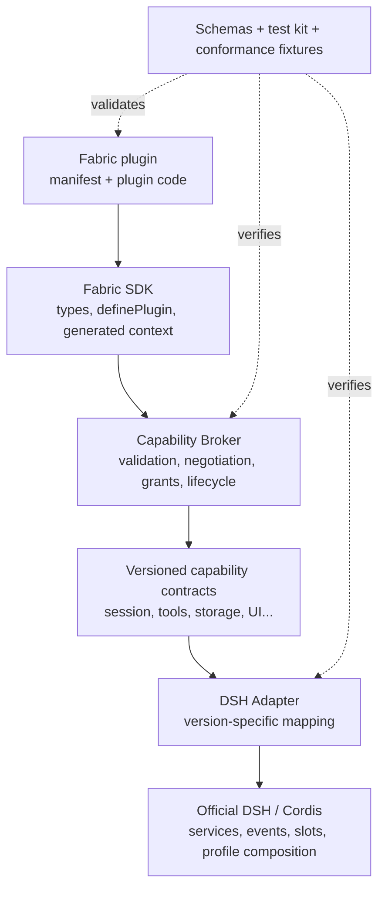

# Fabric 兼容层与开发框架设计

[English](compatibility-layer.md) | 中文

状态：Design Draft。本文描述 DSH Community Fabric 最重要的产品边界：插件如何在不直接依赖官方源码或内部 service 的情况下，使用稳定能力完成真实工作。

## 1. 我们真正要解决的问题

仅有 manifest 还不够。Manifest 可以告诉 Host“插件想做什么”，但如果插件随后仍然直接 import 官方内部模块、读取私有对象或 patch 源码，上游一更新，生态仍会整体破裂。

Fabric 必须提供一层稳定中间层：

```text
插件代码
  ↓ 只依赖稳定 Fabric SDK、DTO 与 capability
Capability Broker
  ↓ 协商、授权、生命周期、资源 ownership
版本化 DSH Adapter
  ↓ 把稳定 contract 映射到官方 service / event / slot / profile composition
官方 DSH / Cordis runtime
```

插件不感知具体 DSH 版本。Adapter 是唯一允许吸收上游变化的地方。无法保持语义时，Adapter 必须关闭对应 capability 并给出原因，不能返回“看起来成功”的近似结果。

## 2. 五条架构不变量

1. **Fabric entrypoint 只依赖 Fabric contract。** Fabric 标准 entrypoint 运行时不依赖 DSH、Cordis、Desktop 或 Adapter package，不获取上游实现对象，也不读取私有 service 或 monkey patch 官方函数。只有 Adapter 可以 import 上游 runtime。
2. **公开边界只传稳定数据。** API 使用版本化 plain DTO、opaque ID 和 typed error，不把上游 class instance、数据库 row 或内部事件对象泄漏给插件。
3. **所有资源都有 activation scope。** Event listener、command、timer、stream 和后台 operation 都归当前插件实例所有，deactivate 时自动取消和释放。
4. **Adapter fail closed。** 上游缺少等价能力时报告 unsupported，不靠私有 patch 猜测语义。
5. **可移植核心与宿主扩展分开。** 跨 Host 能证明一致的能力进入标准命名空间；托盘、Electron、DOM、TUI keymap 等进入组织命名空间 extension。

这些规则首先是受支持 contract 和一致性要求。在 trusted in-process 档位中，lint 和审核可以发现直接上游依赖，但不能像操作系统沙箱一样阻止恶意代码绕过。

## 3. 分层职责



### 3.1 Contract 与 Schema

这一层只定义机器可读事实：manifest、Host Descriptor、capability 名称与版本、DTO、事件 payload、错误码和 conformance fixtures。它不包含 DSH 版本判断或 Electron 代码。

### 3.2 Plugin SDK

SDK 提供类型、`definePlugin()`、activation context、AbortSignal、测试 fake 和少量辅助函数。它不导出官方 Cordis Context，也不允许插件通过一个通用 `get(name)` 获取任意 Host service。

### 3.3 Capability Broker

Broker 是框架核心，负责：

- 校验 manifest 与 entrypoint；
- 对照 Host Descriptor 协商 required / optional capability；
- 执行用户或策略授权；
- 为本次 activation 构造最小 context；
- 跟踪 listener、command、timer、stream 和 operation；
- 在 deactivate 时 abort、drain 和释放资源；
- 把实现错误转换成稳定 Fabric error；
- 记录不包含敏感 payload 的兼容与审计事件。

Broker 不应包含某个 DSH 版本的特殊判断。

### 3.4 DSH Adapter

Adapter 是唯一的上游翻译层。每个 Adapter 版本明确声明支持的 DSH runtime 范围，并把 capability 映射到官方公开机制。

实现优先级：

1. 官方公开 service、event、slot、route 与 profile composition；
2. 已发布但尚不稳定的公共 contract，必须固定版本并有真实集成测试；
3. 私有源码路径、猴子补丁或修改上游文件不得成为稳定 capability。若实验确实需要，应放在显式 experimental vendor extension 中。

Adapter 测试必须同时覆盖 fake contract 和真实、固定版本的 DSH runtime。上游升级先在 Adapter compatibility matrix 中验证，再改变支持范围。

### 3.5 Host integration

GUI、Web UI、TUI 或启动器负责选择并装配 Broker 与 Adapter，发布真实 Host Descriptor，并提供授权和错误提示界面。Host 不必实现所有 capability；缺失是合法状态，伪装支持不是。

## 4. 支持范围：做到什么程度

Fabric 不追求“一开始覆盖一切”。它应该先覆盖插件最常见、最容易稳定抽象的 80%，剩余能力通过版本化模块逐步进入。

实验性 v0.1 的精确范围会刻意保持很小。`host.info`、`log` 和生命周期取消信号是每次 activation 都具备的基础 context；首批需要协商的 capability 只有 `storage.local`、`commands` 和一个不可修改的 `messages.observe` 事件。下表中的其他项目都是规划候选，在独立 contract 与 fixtures 落地前不属于 v0.1。

这个范围不是凭空列出的 API 愿望清单，而是来自三份源码调研：[成熟插件框架模式](../research/mature-plugin-frameworks.zh.md)、详细的 [VS Code 扩展模型](../research/vscode-extension-model.zh.md)和[十二个代表性 DSH 插件](../research/dsh-plugin-needs.zh.md)。这些调研也规定了 v0.1 必须为后续 Host/Client face、强类型 renderer、跨 face 消息、拦截器、上下文贡献和受控系统访问保留哪些接缝。

这份架构成稿后，[社区 Issue #23](https://github.com/omdsh-dev/community/issues/23) 又提供了具体反例。[意见处置记录](../research/community-issue-23-review.zh.md)解释了每项决定；后续 Draft 分别讨论 [Runtime/Presentation invocation](../rfcs/0002-runtime-presentation-invocation-transport.zh.md)、[service composition](../rfcs/0003-service-providers-and-composition.zh.md)和[溯源与 effect ownership](../rfcs/0004-provenance-validation-and-diagnostics.zh.md)，避免其中任何一项暗中扩大实验性 v0.1 contract。

### 4.1 Portable Core：所有兼容 Host 都应理解

| Capability | 支持的操作 | 约束 |
| --- | --- | --- |
| `host.info` | 读取 Host ID、版本、平台、标准版本与执行档位。 | 只读、无上游对象。 |
| `log` | 结构化 debug/info/warn/error。 | 自动附插件 ID；禁止默认记录敏感 payload。 |
| `lifecycle` | activation signal、deactivate、健康状态。 | 资源归 activation scope。 |
| `storage.local` | 插件私有 get/set/delete/list。 | 配额、schema version、插件命名空间。 |
| `settings.schema` | 声明设置 schema、读取获准值、观察变更。 | Host 决定呈现，不给 DOM。 |
| `commands` | 为 manifest 中声明的命令绑定 handler。 | ID 必须属于插件命名空间；可发现元数据只有一个权威来源。 |

`storage.local` 是由 Broker 拥有、按插件隔离命名空间的 KV contract，底层只依赖窄的 persistence port。DSH Adapter 不能把上游 storage hub 或数据库对象直接暴露成它的实现。

### 4.2 DSH Domain：由 Adapter 提供的标准领域能力

| Capability | 计划操作 | 进入稳定标准前需要证明 |
| --- | --- | --- |
| `sessions.read` | list/get canonical snapshot、分页读取、观察创建/关闭。 | DTO、分页、隐私裁剪、跨版本 mapping。 |
| `messages.observe` | 观察不可变的 sent/received 事件。 | 每 session 顺序、回压、敏感内容 scope。 |
| `sessions.actions` | create、send、cancel、resume 等用户可见操作。 | 权限、幂等、operation result、失败恢复。 |
| `tools.register` | 注册 schema 化工具并接收取消信号。 | input/output schema、超时、审计、重复调用语义。 |
| `tools.observe` | 观察 tool started/result/failed。 | 脱敏、调用身份和 event ordering。 |
| `models.read` | 枚举经过裁剪的模型能力与当前选择。 | 不暴露 credential 或 provider 私有对象。 |
| `models.provider` | 注册模型 provider。 | 独立 RFC；stream、tool calling、usage、错误语义复杂。 |
| `profiles.read` | 查看可用工作配置和当前选择。 | profile 是 Host 概念时允许 unsupported。 |
| `profiles.select` | 请求有序切换。 | 用户确认、重启边界、回滚。 |

Session 读取即使“只读”也可能高度敏感，仍需明确授权、scope 和裁剪，不能因为不修改数据就标为低风险。

### 4.3 UI 扩展分层

UI 不是一个万能 renderer。Fabric 把它分为四层：

1. **声明式贡献**：命令、设置 schema、菜单、状态、通知、主题 token 和小型表单。宿主拥有呈现、国际化、无障碍、顺序和冲突处理。
2. **强类型 Provider 与命名 Renderer**：工具结果、消息内容、输入框附件、文件查看器、会话树等有明确业务含义的界面。每个扩展点定义输入 DTO、数量、优先级、fallback 和生命周期。
3. **隔离富视图**：GenUI、看板、编辑器、可视化和完整工作台。它们运行在独立 Client/Worker face，通过版本化消息桥和被批准的资源工作，并由宿主决定位置和主题。
4. **宿主扩展**：raw DOM、Electron、原生控件、终端协议和其他无法保持跨宿主语义的能力。

高可移植性候选包括 `ui.notification`、`ui.status`、设置 schema、命令元数据和小型表单。公共 `ui.panel.basic` 仍是以后需要验证的原型，不能用来证明任意 GUI 都能原样运行在 TUI。

Fabric 的 portable API 不提供 raw DOM、React component、Electron BrowserWindow 或 TUI screen handle。富视图和宿主扩展需要独立规范和诚实的兼容标签。

### 4.4 业务行为协议

Fabric 不会用一个只有字符串和 unknown payload 的事件总线承载所有操作：

- **不可变观察流**只报告标准 message、session、tool 或 job 事实，不能改变原操作；
- **命令与动作**是有授权、取消、幂等、稳定错误和审计身份的 request/result 操作；
- **有序拦截器流程**只有在顺序、超时、失败、冲突、隐私和重入语义都明确后，才允许 allow、deny 或有限 rewrite；
- **上下文贡献流程**收集有界、有来源、有预算的记忆或指令片段，并在执行前冻结结果；
- **持久任务**定义身份、进度、checkpoint、取消、重试、所有者和重启行为。

v0.1 只包含不可变 `messages.observe`。拦截器、上下文贡献和持久任务必须有独立 RFC 与 conformance fixture。

### 4.5 Sensitive mediated capabilities

`net.fetch`、`workspace.read/write`、clipboard、secret、process、terminal 和 package management 必须是受管操作：输入有 scope、输出有界、支持取消、产生审计，并在权限新增时重新确认。

在 trusted in-process 模式中，这些授权仍不是强沙箱。真正的权限强制需要 isolated execution。`process.spawn`、任意 shell、原始 Electron 和无范围文件系统不进入 portable core。

### 4.6 Host extensions

无法跨 Host 保持语义的能力使用组织命名空间：

- `x-ai.anywhere.desktop.tray`
- `x-org.example.tui.keymap`
- `x-org.example.web.panel`

Extension 仍应有 schema、版本和生命周期，但不会被描述为全生态可移植能力。标准化必须由至少两个独立 Host 的真实实现推动，而不是把一个产品私有 API 直接改名。

## 5. Canonical DTO：隔离上游变化的关键

插件只接收 Fabric DTO，不接收官方 class instance 或数据库结构。DTO 应遵循：

- 可 JSON / structured-clone 序列化；
- 字段有 schema 和版本；
- ID opaque，插件不能解析内部路径或数据库 key；
- 时间、分页、排序和缺失值语义明确；
- 列表默认有界并支持 cursor；
- 敏感内容默认最小化，按 grant 扩大 scope；
- event payload 不可变；
- mutation 返回明确 operation outcome，不返回内部 controller；
- 错误转换为稳定 code，例如 `unsupported`、`permission-denied`、`aborted`、`conflict`、`upstream-unavailable`。

当上游 DTO 变化时，Adapter 完成双向转换。若转换会丢失标准要求的语义，Adapter 必须取消该 capability 的支持声明。

## 6. 目标开发体验

以下是目标体验，不是当前已经发布的命令或 API。

### 6.1 项目结构

```text
my-fabric-plugin/
  dsh-plugin.json          # 唯一静态声明
  src/index.ts             # 只 import Fabric SDK
  tests/plugin.spec.ts
  package.json
```

### 6.2 开发流程

```sh
yarn dlx dsh-community-fabric init
yarn fabric validate       # schema、ID、entrypoint、capability 版本
yarn fabric generate       # 从 manifest 生成精确 context 类型
yarn fabric test           # fake Host + lifecycle + capability fixtures
yarn fabric dev --host web # 连接明确的开发 Host integration
yarn fabric pack           # 产出静态 manifest 与可审查包
```

命令名称尚未冻结。关键是同一份 manifest 同时驱动静态校验、类型生成、市场兼容判断和 Host 协商，避免配置重复。

### 6.3 插件代码

```ts
import { definePlugin } from 'dsh-community-fabric/sdk'

export default definePlugin(async (ctx) => {
  ctx.commands.handle('com.example.hello.open', async () => {
    ctx.log.info('Hello from Fabric')
  })

  ctx.messages.onReceived(async (message) => {
    await ctx.storage.local.set('lastMessageId', message.id)
  })

  // registrations are activation-scoped and are released automatically.
  // ctx.signal aborts when this instance is deactivated.
})
```

这个示例只表达希望达到的形状。命令元数据以 manifest 为权威，代码只按 ID 绑定 handler。实际 SDK 必须由 manifest 生成精确 context：未声明的 capability 在类型中不存在，在运行时调用也会失败；optional capability 在 `ctx.capabilities.has(name)` 完成类型收窄前仍是可选成员。不能提供绕过协商的 `ctx.get(anyName)`。

v0.1 的 manifest 到 SDK 映射只有一条规范路径：

| Contract 项 | SDK member |
| --- | --- |
| 基础 `host.info` | `ctx.host` |
| 基础 `log` | `ctx.log` |
| 基础 lifecycle cancellation | `ctx.signal` |
| `storage.local` | `ctx.storage.local` |
| `commands` | `ctx.commands.handle(id, handler)` |
| `messages.observe` | `ctx.messages.onReceived(handler)` |

Capability ID 描述协商 contract，SDK member 提供符合 TypeScript 习惯的类型化入口。这份映射由工具生成，不由每个插件重复配置。

### 6.4 可理解的失败

插件作者和用户不应该看到上游 stack 或内部 service 名。框架提供稳定错误：

- manifest 无效；
- Host API 版本不兼容；
- required capability 缺失；
- capability 未授权；
- Adapter 暂时不可用；
- operation 被取消、超时或冲突；
- plugin activation 失败。

每个错误同时包含机器 code、面向开发者的 detail 和可本地化的用户摘要，但不能泄漏 token、消息正文或本地路径。Adapter 诊断会在 Host 自有日志中通过 correlation ID 保留原始上游 cause；这个 cause 不会跨入插件侧 contract。

## 7. Host 与 Adapter 开发体验

Host 维护者不应重复实现 manifest parser、SemVer、授权状态机或生命周期 Broker。Fabric reference packages 最终可拆为：

```text
schema/        静态 schema 与校验器；不依赖 Host 或 DSH
contract/      DTO、错误、capability interface 与 Adapter SPI
sdk/           definePlugin 与插件侧 generated context
broker/        negotiation、grant、activation scope 与 resource ownership
dsh-adapter/   唯一允许 import DSH/Cordis runtime package 的层
testkit/       headless fixtures 与共享 conformance suite
cli/           init、validate、generate、test 与 pack
```

具体 npm package/subpath 在 RFC 接受前不冻结。`dsh-community-fabric` 可以作为轻量的插件侧统一入口，但默认不能重新导出 Broker 或 Adapter。依赖方向保持单向：schema 不依赖 Host；contract 只依赖 schema；SDK 依赖 contract；Broker 依赖 schema 与 contract，但不依赖 DSH；只有 `dsh-adapter` import 上游 runtime package。生产 Host Descriptor 属于 schema/contract 边界，授权属于 Broker 职责，不能藏在测试工具中。

Host 注册 capability implementation 后，由工具生成 Host Descriptor，避免文档与实际实现漂移。每项实现运行 `testkit` 提供的同一套 headless contract suite；真实 DSH integration test 仍由 `dsh-adapter` 持有。完整 Host 再运行生命周期和跨 capability integration tests。

## 8. 版本与上游升级

Adapter 维护显式 compatibility matrix：

| Fabric API | Adapter | DSH runtime | 状态 |
| --- | --- | --- | --- |
| 0.1.x | adapter-dsh 0.1.x | 明确范围 | experimental / tested / unsupported |

升级流程：

1. 固定新上游版本，运行真实 Adapter contract tests；
2. 检查每项 capability 的 DTO 与行为语义；
3. 只修改 Adapter 能保持的 mapping；
4. 无法保持的能力从 Host Descriptor 移除，并给出迁移说明；
5. 标准 contract 只有在社区 RFC 和兼容窗口流程下才发生 breaking change。

插件无需为每个 DSH 版本发布变体。Adapter 也不能通过吞掉错误来制造“版本兼容”。

## 9. 现有插件迁移

迁移按能力逐步进行，不要求一夜重写：

1. 生成静态 manifest，记录当前真实依赖和 Host 限制；
2. 用检查工具列出直接上游 import、私有 service、源码 patch 与全局副作用；
3. 把已有能力逐项替换成 Fabric contract；
4. 尚无标准能力的部分保留为明确 legacy 或 vendor extension；
5. 在至少两个 Host product/integration，或一个 Host + fake conformance suite 上验证；
6. 最后才申请“Fabric compatible”结果。

现有 `cordis.patch.yml` 是官方声明式 composition，不是源码 patch，可以继续作为 Adapter 或 bundle 的装配入口。Fabric 不要求现有 DSH 插件立即失效。

## 10. 分阶段交付

### Stage A：不会执行插件的基础设施

- Manifest 与 Host Descriptor Schema；
- pure negotiator；
- canonical errors；
- fixtures、lint 与 package inspection；
- 文档和 RFC 治理。

### Stage B：最小 Broker 与 trusted DSH Adapter

- activation scope、AbortSignal、自动 resource ownership；
- v0.1 的精确基础与协商集合：`host.info`、`log`、生命周期取消、`storage.local`、`commands` 和不可修改的 `messages.observe`；
- 固定 DSH 版本上的真实 contract tests；
- 明确标注 trusted-in-process。
- 完整 v0.1 能力存在后，由两个 Host product 或 integration 提供 interoperability evidence；它们可以共享同一个版本化 DSH Adapter。

### Stage C：DSH 领域能力

- v0.1 消息事件之外的 canonical session 与 tool DTO；
- 更多不可修改的观察事件；
- 用户触发的 session action；
- tool registration；
- 强类型 Host/Client bridge 与静态资源 transport；
- 受控 files/artifacts、network 和 secret reference；

### Stage D：UI 与敏感能力

- 声明式贡献与强类型 renderer 原型；
- 一个隔离富视图原型；
- 上下文贡献与有序拦截器 RFC；
- process/PTY/job 与事务化包管理 contract；
- permissions UX；
- isolated runner 原型。

每个 Stage 可以独立使用和验证。不能为了演示完整故事，在早期阶段偷偷暴露 raw upstream context。

## 11. 成功标准

Fabric 成功不是“API 数量很多”，而是：

- 一个普通插件在不 import 上游 runtime 的情况下完成真实功能；
- 同一 package 能被两个 Host product 静态判断并正确激活或拒载；
- DSH 上游升级时，大部分修复只发生在 Adapter；
- 插件拿到的是稳定 DTO 和错误，而不是内部对象；
- Host 缺失能力时用户得到明确说明，不是安装后崩溃；
- reference Broker、Adapter 和 plugin 都能在 headless CI 中跑 conformance tests；
- 文档不会把兼容声明冒充安全审核或强制权限。

## 12. 仍需社区决定

1. v0.1 之后，下一项 DSH 领域能力应是 `sessions.read`、`sessions.actions`，还是 `tools.register`？
2. Manifest 如何驱动 TypeScript 精确类型，避免生成文件与 source drift？
3. Host、Client 和隔离 Worker 的 face 与通信协议如何拆分？
4. Adapter 可以依赖哪些上游 public contract，experimental extension 的红线在哪里？
5. 权限 grant 按插件、profile、workspace、session 还是设备保存？
6. 哪些 DTO 内容默认需要脱敏？
7. vendor capability 何时有资格进入 portable standard？
8. “Fabric compatible”测试结果由谁发布、如何撤销？

这些问题应通过独立 RFC、fixtures 和原型回答，而不是由某个参考实现的偶然行为决定。
